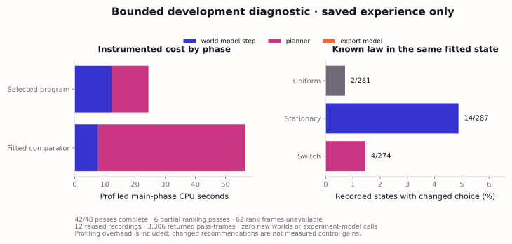
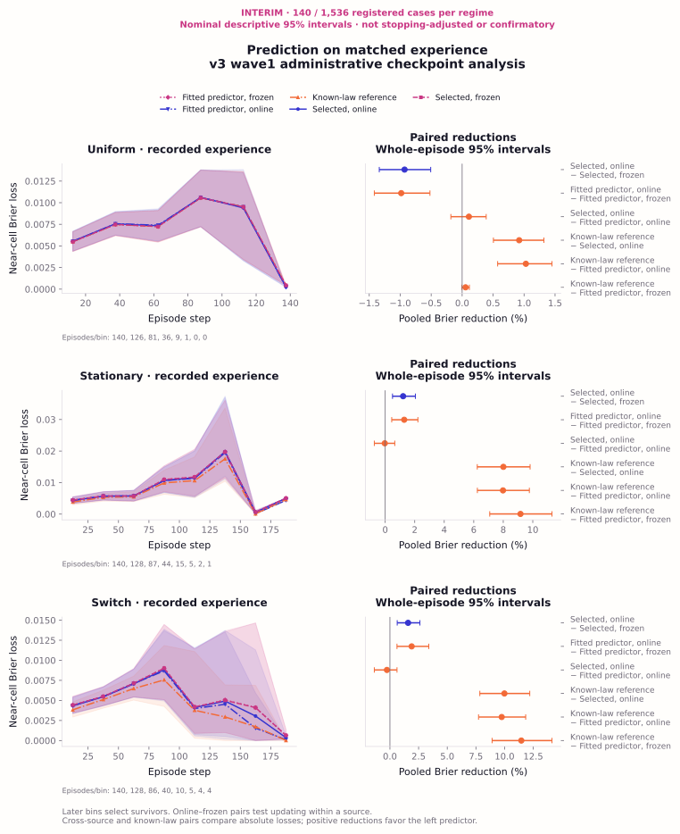
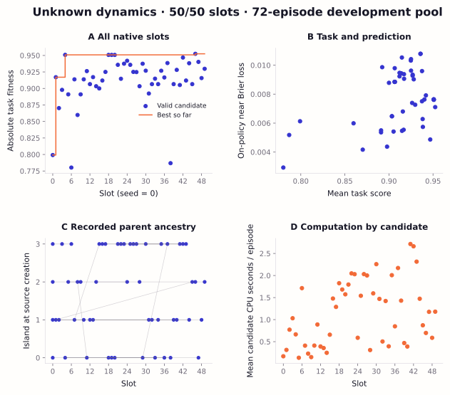
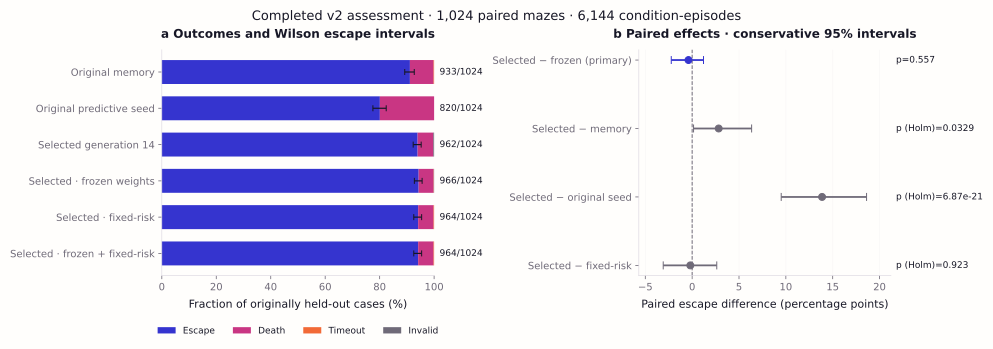
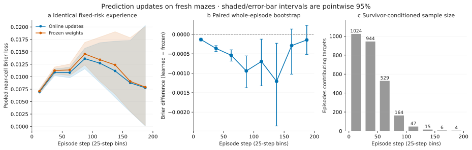
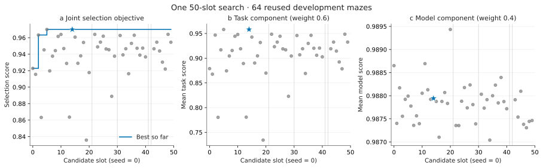
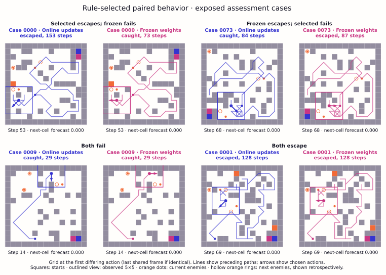
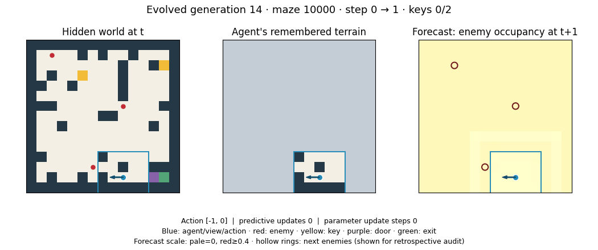

# ShinkaDreamer: prediction learning and control after evolutionary program search

## Unknown dynamics: current experiment

**Interim result: online learning improves prediction under unknown dynamics;
an escape benefit remains unestablished.** The user-requested saved-data
[assessment and decision report](docs/v3-interim-assessment.md) covers 140 paired
cases, 4,200 world episodes and 2,100 passive prediction passes. On identical
memory-policy experience, the selected learner reduces near-cell Brier loss by
1.21% [0.50, 2.05] under private stationary laws and 1.58% [0.63, 2.61] with a
switch; under uniform dynamics it worsens loss by 0.93% [0.51, 1.34]. Selected
online minus frozen escape is +3.57 percentage points [−2.79, +10.78] and +0.71
[−5.89, +6.73] in stationary and switch cases. These are nominal, descriptive
95% intervals from an unfinished assessment, not confirmatory conclusions.

The 50-slot search is complete. Generation 4 captured 98.97% of its eventual
best development-task gain; 45 later slots added no development escapes and
selection retained generation 4. The full 1,536-case assessment remains paused:
all workers exited and no automatic resumption is scheduled. This interim
analysis added no episodes or experiment model calls. See the [full result tables](artifacts/campaign-v3/assessment-interim140/tables.md),
[matched prediction tables](artifacts/campaign-v3/assessment-interim140/matched-tables.md)
and [original checkpoint report](docs/v3-checkpoint-report.md).

The subsequent user-authorized **20-minute development diagnostic is complete**:
48 capped replay attempts used existing recordings, with zero new worlds or
experiment-model calls. Execution took about two minutes. All 24 profiled passes
completed; six additional traced comparator passes hit the unchanged CPU cap.
All 1,622 comparable action/model hashes matched between instrumentation modes.
Planning used 85.94% of the fitted comparator's measured main-phase CPU under
profiling; selected cost split roughly equally between forecasting and planning.
At identical fitted internal states, true laws changed choices in 2/281 uniform,
14/287 stationary and 4/274 switching decisions. These recommendations were not
executed, so they do not measure escape benefit. The
[diagnostic report](docs/v3-development-diagnostic20.md) proposes a local
transition-probability cache and removal of duplicate forecast work. Neither
optimization has been applied or benchmarked; the large assessment stays paused.



A separate **v3 wave completed one 50-slot native ShinkaEvolve search**. Enemies
retain nine attempted moves, including waiting; blocked moves become stays. The
three equally weighted regimes are the original uniform law, a privately drawn
stationary directional law, and an unannounced change of law. The maze, partial
observation, keys, gating door, exit, dynamic walls and 200-action horizon remain.
This search optimizes absolute task performance; proper prediction losses are
diagnostics and textual feedback. It starts from the immutable original
predictive seed, separately from the manually fitted directional comparator.

The [completed search report](docs/v3-search-results.md),
[every-candidate table](artifacts/campaign-v3/search.csv),
[interactive Chromatic Field explorer](artifacts/campaign-v3/search-explorer.html),
[native execution audit](artifacts/campaign-v3/native-audit.json) and
[methods](docs/v3-methods.md) distinguish completed work from planned assessment.
The [source review](docs/v3-program-changes.md) records substantive changes,
actual ancestry and intervention caveats. Download and open the explorer HTML
locally to inspect all candidates, linked plots, ancestry and patch rejections;
it needs no server or external assets.
The local [assessment progress page](http://localhost:8000/assessment.html)
refreshes saved execution counts and links to the native Shinka dashboard.
Start both with `.venv/bin/python scripts/v3_webui.py --port 8000`.
Selection validation chose **generation 4** (180/192 escapes), a direct descendant
of the original seed with uniform, slow and fast directional movement experts.
This score is selection-biased. Its development audit verifies that freezing
predictive parameters leaves mapping active and that substituting a uniform law
changes the predictions used by its existing planner. Learning changed action
sequences in 50/72 development cases without changing escape outcomes.

The [frozen assessment design](docs/v3-assessment-design.md) specifies **1,536
paired layout cases shared across all three regimes**, ten on-policy conditions and five passive predictors
on identical recorded experience. The program, comparators, interventions,
precision and analysis were frozen before drawing fresh cases. That assessment
is incomplete and remains paused; development results do not establish
generalization or a control benefit. The separately recorded 140-case interim
analysis preserves all invalids, uses whole-case paired resampling and retires
the exposed cases from future fresh testing. One search cannot establish
reliable discovery across independent runs.



Reproduce the interim statistics with
`OPENBLAS_NUM_THREADS=1 .venv/bin/python scripts/v3_interim_analysis.py --compact`.
The [report](docs/v3-interim-assessment.md#reproduction-and-preserved-checkpoint)
includes figure commands and the preserved, currently paused simulation command.



The closed v2 study below retains its original source, data, numbers, figures and
reproduction paths. Its historical cases are exposed and are not fresh v3 tests.

## Closed v2 experiment: abstract

How can evolution produce agents that learn how their world works and use that knowledge to act? ShinkaDreamer investigates this question in a changing maze where an agent must collect keys, unlock an exit and avoid moving enemies while seeing only its immediate surroundings. ShinkaEvolve evolves the agent’s code, jointly modifying its world model, learning rules and planner. Within each episode, the resulting agent learns from experience to predict enemy movement and uses those predictions when choosing actions.

The evolved agent performed better than the original agents on unfamiliar mazes, and its online learning improved predictive accuracy. However, controlled interventions did not establish that learning or using those predictions caused the improvement in escape success. The study therefore identifies two distinct achievements—evolving better behavior and evolving a model that learns—while leaving their connection unresolved. This motivates the next research question: when environmental dynamics are unknown or change, can evolution discover learning procedures whose predictions make a demonstrable difference to the agent’s decisions?

We assessed a program selected by one 50-slot LLM-guided evolutionary search
on **1,024 fresh paired mazes**, with six conditions and **6,144 episodes**.
Generation 14 escaped in **93.95%** of cases, compared with **91.11%** for the
immutable memory baseline and **80.08%** for the original predictive seed.
Paired improvements were **+2.83 percentage points** (95% interval +0.15 to +6.35)
and **+13.87 points** (+9.51 to +18.62), respectively; both secondary tests passed
the prespecified Holm correction. On verified identical fixed-risk trajectories,
online updates reduced pooled near-cell Brier loss by **3.31%** (95% interval
2.91–3.71%). This prediction gain did **not establish a control gain**: selected
minus frozen-weight escape was **−0.39 points** (−2.23 to +1.21; exact McNemar
p=0.557), and selected minus fixed-risk escape was **−0.20 points** (−3.09 to +2.63;
Holm p=0.923). The experiment supports generalization of this evolved program and
its predictive learner under the existing maze generator, while leaving the
escape benefit of updating or using predictions unestablished.

## V2 research questions

A partially observed agent can predict more accurately without choosing better
actions. We distinguish three questions: **(1)** does the selected evolved
controller outperform its starting program and a competent memory baseline on
fresh mazes; **(2)** do within-episode updates improve prediction on identical
experience; and **(3)** do updating or using those predictions increase escape?
The distinction matters because the search jointly changed representations,
learning and planning, while its selection score mixed task and model components.

The project originates in [Namazu's proposal](docs/namazu-proposal.md), supplied
by Roland Löchli and attributed to Sakana AI's Namazu model. The original text is
preserved unchanged. Predictive learning and before-outcome forecast scoring are
explicit extensions to its reconstruction-based objective; coordinate, door,
movement and generation repairs are documented separately in the
[protocol](docs/protocol.md). This is an independent implementation.

## Related work

LLM-guided program search combines generative proposals with executable tests.
FunSearch demonstrates this arrangement for mathematical constructions and
algorithmic heuristics [1]. ShinkaEvolve adds native population management,
parent sampling, novelty mechanisms and model selection [2]. Our experiment uses
its actual program database, four islands, parent/inspiration sampling, archive,
migration and recommendations. The authorized route used a single mutation-model
configuration and disabled embeddings and novelty LLM calls; it therefore does
not test a model bandit or embedding-based novelty. Candidate indices identify
individual proposal slots. The evolving object is Python source with editable
representations and helpers, rather than a fixed vector of hyperparameters.

Predictive world models can support control, but prediction accuracy is not itself
a control outcome. Dreamer learns neural latent dynamics and trains an actor and
critic through imagined trajectories [3]. ShinkaDreamer instead assesses an
interpretable spatial probability model and short heuristic lookahead; it does
not implement neural Dreamer. The v2 program's online optimizer follows AdaGrad's accumulated
squared-gradient idea [4], and its forecast loss is binary Brier error [5]. The
experiment tests this discovered learner's behavior rather than claiming a new
optimizer or a new proper scoring rule.

Executable world models and learned learning rules also have established
precedents. [WorldCoder](https://arxiv.org/abs/2402.12275) builds Python world
models from interaction and plans with them. [Learned Policy Gradient](https://arxiv.org/abs/2007.08794)
and [DiscoRL](https://www.nature.com/articles/s41586-025-09761-x) discover prediction
and update rules through meta-learning. ShinkaDreamer's present contribution is
an empirical test of evolved online adaptation and its control benefit in this
particular partially observed maze. It makes no priority claim for executable
world models, learned RL algorithms or program evolution.

## V2 methods

### Environment and independent evaluation

The world is a **15×15 dynamic maze**, observed through a **5×5 local square**.
The agent must collect two keys, open a door physically gating the exit and escape
within 200 actions while avoiding three moving enemies. Actions are the eight
neighboring displacements and waiting. Diagonal corner cutting is prohibited;
wall changes occur every 25 steps, skip occupied closures and retain objective
reachability in every phase. Feedback supplies actual displacement and inventory.
The evaluator owns the hidden map, enemy states and independent layout, enemy and
forecast-target RNG streams. Candidate code receives observations and feedback
through a restricted worker, never the hidden environment or case seeds.

Enemies draw uniformly from the nine attempted displacements at every step;
blocked attempts become waits. The transition law is common across mazes and
has neither pursuit nor momentum. The present assessment tests new layouts and
trajectories under this same law, not generalization to unknown or changing laws.
The agent refreshes remembered walls but does not learn their change schedule.

Forecasts are exported after action selection and **before** the world advances.
The evaluator scores stationary target cells at the next step: nine cells around
the old position and twelve independently sampled interior cells. Terminal steps
are included. We report pooled near-cell, uniform-audit and threat-conditioned
Brier losses, with loss `(p − y)²`. Threat conditioning selects steps with a visible
nearby enemy; it is a related diagnostic, not another independent experiment.
Missing probabilities use the declared default; omitted defaults receive 0.5.
Memory's forecast comparator is visible-occupancy persistence with 0.02 elsewhere.

The unchanged selection objective for valid episodes is

$$
T=0.65E+0.10K+0.10D+0.05E(1-s/200),\qquad
M=1-\tfrac12(L_{\rm near}+L_{\rm audit}),\qquad F=0.6T+0.4M,
$$

where E indicates escape, K is the number of keys (0–2), D indicates an open door
and s is the episode length. Selection averages episode scores equally; displayed
Brier diagnostics pool target sums and counts. These weightings differ. Invalid
execution receives zero selection score and remains a recorded non-escape.
The assessment changes neither this kernel nor its resource limits.

### The evolved world model and planner

There are two adaptation timescales. Across candidate slots, LLM proposals changed
`world_model_step`, `planner`, representations and helpers. Within an episode,
generation 14 localizes using movement feedback, integrates terrain and observation
ages, filters anonymous enemy occupancy and updates **ten transition weights**.
Memory and weights reset between mazes.

The model distributes occupancy mass from each possible source e over legal
neighboring destinations q using a spatial softmax,

$$
P_\theta(q\mid e,c)=\frac{\exp(\theta^\top\phi(e,q,c))}
{\sum_{r\in L(e)}\exp(\theta^\top\phi(e,r,c))},\qquad
\widehat p(q)=1-\prod_e[1-b(e)P_\theta(q\mid e,c)].
$$

Features describe staying, diagonal movement, approach, proximity, corridor
geometry, connectivity and inferred flow. They are hypotheses available to the
model, not evidence that enemies actually pursue the agent. The anonymous union
approximation does not represent a full joint distribution over enemy identities.

New observations label the previous view's inner 3×3 cells. Brier gradients through
the saved visible-source softmax rows update the weights, with regularization
`0.003(θ − θ₀)`, gradient clipping at ±3 and accumulated squared gradients G:

$$
G_i\leftarrow G_i+g_i^2,\qquad
\theta_i\leftarrow\operatorname{clip}_{[-6,6]}
\left(\theta_i-\frac{0.20g_i}{\sqrt{0.20+G_i}}\right).
$$

Map updates and occupancy filtering continue when these predictive weights are
frozen. Planning combines risk-weighted paths with two-action lookahead.
Generation 14's continuation model retains mutually exclusive destinations for
each anonymous source: surviving the first move rules out the destination just
occupied by the agent, and remaining alternatives are renormalized before the
second risk estimate. Costs and the 0.65 discount on entry hazard are heuristic.
The final exported forecast is recomputed around the chosen destination, whereas
first-move comparison uses the current position. Scored and planning forecasts
are consequently not perfectly identical. The
[walkthrough](docs/evolved-agent.md) documents the exact source functions.

## V2 experimental design

### Frozen selection and fresh cases

The completed search has **50 total slots**, including one seed, 45 valid
descendants and four failed descendants. It was not extended. Generation 14 was
fixed before this assessment at SHA-256
`588eeb7c10b978fe86c7e7b572f177e8b755c9c25699f3c75bfadd41192ec5e0`.
The reviewed repository state was `02d1579`; no newer remote work or pre-existing
v2 assessment was found. The [preregistration](artifacts/campaign-v2/assessment-1024/preregistration.json)
was committed at `38e437a` **before** reserving 1,024 new paired cases, excluding
prior pools. The fixed sample was completed regardless of intermediate outcomes.
No agent tuning, new search slots or model calls occurred.

| Condition | Program | Predictive updates | Planning risk |
|---|---|---|---|
| Original memory | Immutable original memory/pathfinding control | None | Fixed heuristic |
| Original seed | Immutable original predictive program | Original count updates | Original predictive planner |
| Selected | Generation 14 | Softmax weight updates | Predictive |
| Frozen | Generation 14 | Frozen weights | Predictive |
| Fixed-risk | Generation 14 | Softmax weight updates | Fixed heuristic |
| Frozen + fixed-risk | Generation 14 | Frozen weights | Fixed heuristic |

All six conditions use the same **1,024 cases: 6,144 condition-episodes**.
Fixed-risk planning retains pathfinding and lookahead; it substitutes the hazard
estimate. Original controls resolve to hash-verified original programs rather
than flags applied to the evolved source. Condition order rotates by case index.

The primary mechanistic outcome is the paired **selected-minus-frozen escape
probability**. Prespecified secondary escape contrasts compare selected with
memory, original seed and fixed-risk planning. Secondary two-sided exact McNemar
p-values receive Holm correction across those three tests at familywise alpha
0.05 [6], independently of the primary outcome. This is a separate secondary
family, not global correction over every reported metric. All directions are
reported. Other binary outcomes and forecast intervals are explicitly exploratory
or estimation results, without additional confirmatory p-value claims.

### Paired inference and intervention verification

Binary results report per-condition Wilson 95% intervals, paired wins/losses and
exact McNemar tests. Paired difference intervals use a conservative exact-binomial
construction, avoiding the zero-width intervals a percentile bootstrap can give
with few discordances. For discordance probability q and conditional win
probability θ, the effect is q(2θ−1). Separate 97.5% Clopper–Pearson intervals give
a rectangle with at least 95% joint coverage; its transformed extrema bound the
effect. With zero discordances, θ spans [0,1]. The
[design](docs/assessment-design.md) gives the derivation. These intervals are
conservative and need not invert McNemar's test. Simultaneous Bonferroni intervals
for the three secondary differences are also in the analysis data [7].

During the **actual assessment**, the shared development-audit logic hashed full
action/world/enemy trajectories and map/localization histories, then discarded
traces after each episode. It recorded parameter constancy and changes, update
counts, visible-map correctness, localization correctness and memory activity.
Only verified identical fixed-risk histories qualify as matched experience.

For forecast differences and relative reductions, 10,000 bootstrap draws resample
whole paired episodes and recompute pooled error sums divided by target counts.
The RNG seed is fixed at 20260930. Learning-curve intervals are pointwise; late
bins condition on survival and show their sample sizes. On-policy forecast losses
under different actions are reported separately. Successful-escape steps and
runtime condition on success and are not unconditional efficiency measures.

## V2 results

The three research questions have different answers. **Evolutionary performance
generalizes for this selected program:** it wins 189 and loses 47 escape pairs
against its original seed, and wins 83 and loses 54 against memory. **Within-episode
predictive learning generalizes on matched experience:** updating improves pooled
forecast loss under an unchanged fixed-risk policy. **A control advantage from
updating or using predictions is not established:** both corresponding escape
estimates are slightly negative, with intervals spanning meaningful benefit and
harm.

The memory comparison is modest and imprecise: Holm-adjusted p=0.0329, with the
pointwise interval shown below. Its more conservative simultaneous interval is
−0.34 to +7.03 percentage points. That interval and the Holm test use different
constructions; they are not inversions of one another. The larger improvement
over the original seed is much clearer (Holm p=6.87×10⁻²¹).

### Fresh-assessment outcomes and effects

| Condition | Escapes; rate % [95% CI] | Deaths | Timeouts | Invalid |
| --- | --- | --- | --- | --- |
| Original memory | 933/1024; 91.11 [89.21, 92.71] | 89 | 2 | 0 |
| Original predictive seed | 820/1024; 80.08 [77.52, 82.41] | 204 | 0 | 0 |
| Selected generation 14 | 962/1024; 93.95 [92.31, 95.25] | 59 | 0 | 3 |
| Selected, frozen weights | 966/1024; 94.34 [92.75, 95.59] | 56 | 1 | 1 |
| Selected, fixed-risk | 964/1024; 94.14 [92.53, 95.42] | 58 | 2 | 0 |
| Selected, frozen + fixed-risk | 964/1024; 94.14 [92.53, 95.42] | 58 | 2 | 0 |

| Comparator to selected | Paired escape wins / losses | Difference, pp [95% CI] | Exact p | Holm p |
| --- | --- | --- | --- | --- |
| Frozen weights (primary) | 11 / 15 | -0.391 [-2.230, 1.212] | 0.5572 | — |
| Original memory | 83 / 54 | 2.832 [0.150, 6.347] | 0.01643 | 0.03286 |
| Original seed | 189 / 47 | 13.867 [9.506, 18.615] | 2.29e-21 | 6.869e-21 |
| Fixed-risk | 53 / 55 | -0.195 [-3.087, 2.627] | 0.9234 | 0.9234 |

Positive effects favor the selected program. The [complete numerical report](docs/assessment-results.md) provides rate intervals and paired counts/tests for death, timeout, door completion and both keys, plus simultaneous secondary intervals. No direction is omitted.



*Figure 1. All 1,024 paired cases per condition. Outcome bars distinguish escape,
death, timeout and invalid execution; whiskers show Wilson escape intervals.
The forest plot shows conservative 95% paired difference intervals. The primary
p-value is exact McNemar; secondary p-values are Holm-adjusted. Marginal intervals
are not simultaneous secondary intervals; those are supplied in the analysis.*

| Condition | Mean keys | Door open / 1024 | Mean task [95% CI] | Steps, all episodes | Steps, successful escapes | Seconds / episode |
| --- | --- | --- | --- | --- | --- | --- |
| Original memory | 1.934 | 933 | 0.9078 [0.8923, 0.9226] | 62.2 | 63.6 | 0.425 |
| Original predictive seed | 1.855 | 820 | 0.8147 [0.7936, 0.8352] | 54.2 | 57.3 | 0.358 |
| Selected generation 14 | 1.952 | 962 | 0.9336 [0.9209, 0.9460] | 55.0 | 55.9 | 2.540 |
| Selected, frozen weights | 1.954 | 966 | 0.9370 [0.9244, 0.9493] | 54.5 | 55.4 | 2.325 |
| Selected, fixed-risk | 1.956 | 964 | 0.9356 [0.9227, 0.9479] | 54.9 | 55.6 | 1.241 |
| Selected, frozen + fixed-risk | 1.956 | 964 | 0.9356 [0.9227, 0.9479] | 54.9 | 55.6 | 1.251 |

Successful-escape time conditions on each agent’s own successful cases; it is not an unconditional performance measure. Unconditional episode length includes early deaths and execution failures. Host runtime includes startup, evaluation, IPC and temporary trace collection under four-case concurrency. Runtime intervals, medians, tails and success-conditioned seconds are in the complete report.

Selected task score exceeds memory by 0.02587 (paired 95% interval
0.00699–0.04531) and the original seed by 0.11895 (0.09515–0.14306). Its successful
escapes average 55.92 actions, compared with memory's 63.63, but those means use
different successful subsets. Computation is more expensive: selected episodes
average 2.540 host seconds versus 0.425 for memory and 1.241 for fixed-risk.
The paired selected-minus-fixed-risk runtime difference is 1.299 seconds
(1.213–1.389). These are measurements of this audited local runtime, not portable
CPU benchmarks or evidence that shorter failed episodes are better.

### Prediction learning on identical experience

The fixed-risk learned and frozen conditions have identical action/world/enemy
and map/localization hashes on **all 1,024 cases**. Neither condition has an invalid
execution. Their near-cell losses are 0.009263 and 0.009580 over **506,250 targets
per condition**: difference **−0.000318**, paired 95% interval
**[−0.000363, −0.000273]**. The relative reduction is **3.31% [2.91%, 3.71%]**.
Uniform-audit loss also decreases, by a smaller **0.265% [0.195%, 0.336%]**.

Learning is not uniformly helpful episode by episode: near loss improves in
571 cases, worsens in 399 and is tied in 54 (numerical tolerance 10⁻¹²). Near and
threat-conditioned loss have the same error sums here: near targets outside
threatening steps incur zero error. Their identical relative reductions therefore
are not independent corroboration. The learning curve contains 1,024, 944, 529,
164, 47, 15, 6 and 4 contributing episodes in successive bins. Its sparse late
bins have wide uncertainty and cannot establish a population-wide temporal trend.

These are the **verified matched-experience** comparisons (learned minus frozen, both using fixed-risk planning):

| Forecast | Learned loss | Frozen loss | Difference [95% CI] | Relative reduction, % [95% CI] | Episodes; targets per condition |
| --- | --- | --- | --- | --- | --- |
| Near | 0.009263 | 0.009580 | -0.000318 [-0.000363, -0.000273] | 3.31 [2.91, 3.71] | 1,024; 506,250 |
| Uniform audit | 0.016856 | 0.016901 | -0.000045 [-0.000057, -0.000033] | 0.26 [0.19, 0.34] | 1,024; 675,000 |
| Threat-conditioned | 0.027125 | 0.028055 | -0.000930 [-0.001059, -0.000802] | 3.31 [2.91, 3.71] | 1,003; 172,881 |

For context, the following losses are **on-policy** and can reflect different trajectories. They are not substitutes for the matched learning contrast. Memory forecasts use the evaluator’s persistence comparator.

| Condition | Near Brier [95% CI] | Audit Brier [95% CI] | Threat Brier [95% CI] |
| --- | --- | --- | --- |
| Original memory | 0.01125 [0.01078, 0.01173] | 0.01783 [0.01754, 0.01813] | 0.03832 [0.03692, 0.03975] |
| Original predictive seed | 0.00739 [0.00708, 0.00771] | 0.01712 [0.01683, 0.01742] | 0.02747 [0.02661, 0.02833] |
| Selected generation 14 | 0.00940 [0.00902, 0.00977] | 0.01678 [0.01649, 0.01707] | 0.02795 [0.02710, 0.02878] |
| Selected, frozen weights | 0.00957 [0.00918, 0.00994] | 0.01684 [0.01655, 0.01713] | 0.02838 [0.02751, 0.02925] |
| Selected, fixed-risk | 0.00926 [0.00890, 0.00962] | 0.01686 [0.01657, 0.01714] | 0.02712 [0.02628, 0.02796] |
| Selected, frozen + fixed-risk | 0.00958 [0.00919, 0.00997] | 0.01690 [0.01661, 0.01719] | 0.02805 [0.02714, 0.02896] |



*Figure 2. Online and frozen predictions under the same fixed-risk actions and
observations. Shading and error bars are pointwise 95% paired-episode bootstrap
intervals; ratios are recomputed on every resample. The right panel counts
contributing episodes, and exact prediction-target counts are in the analysis.
Later bins select longer-surviving episodes and do not establish an unconditional
learning trend. Near and threat losses are related views of the same forecasts.*

### Reused development evidence and the historical seed study

The lineage **0 → 2 → 5 → 14** introduces motion mixtures, a spatial softmax
learner with occupancy propagation and two-step planning, then survival-conditioned
continuation risk. Development escapes rise from 56/64 at the original seed to
62/64 at generations 5 and 14. Generation 5 accounts for **99.96%** of the final
best-score gain; generation 14 adds only 0.00002036, with the same escape outcomes
and 17 fewer total steps. No subsequent candidate improves the selected score.



*Figure 3. One search on 64 reused development mazes. Stars identify generation
14; gray vertical lines mark failed slots. From seed to selected program, the
weighted task contribution is +0.047527 and the model contribution −0.000283.
Most progress is task-driven despite the nominal 40% model weight. Candidate
model scores use different trajectories and cannot isolate learning quality.*

The development audit found a 3.49% matched near-loss reduction and only two extra
escapes from updating. These observations motivated the fresh assessment; they
are not additional independent test cases. The earlier, separate
[handwritten-seed study](docs/seed-study.md) remains unchanged: on 256 historical
withheld cases, seed escape was 83.6% versus memory's 90.2%, and matched updates
slightly worsened forecast loss. Those exposed historical results are not pooled
with the present fresh assessment.

## V2 mechanism analysis

The intervention checks show that freezing did what the comparison requires.
Transition weights stayed constant in **1,024/1,024** episodes of each frozen
condition. They changed in **991/1,024** selected episodes and **993/1,024** learned
fixed-risk episodes; the remaining episodes need not provide an informative
parameter-update opportunity. Mapping changed and localized movement occurred
in every episode of all six conditions. There were **zero localization errors**
and **zero visible-terrain errors across 8,116,112 checks**. All four selected-code
conditions started from the same ten-weight prior.

These checks support a learning effect on predictions, but not a claim that
prediction improvement caused better control. The primary comparison has **11
escape wins and 15 losses**; 951 pairs both escape and 47 pairs both fail. Using
predictive rather than fixed-risk planning gives **53 wins and 55 losses**.
Action choices can change substantially without increasing average escape.
The unchanged fixed-risk branch still escapes in 94.14% of cases. This is
consistent with much of the evolved controller's competence residing in its
navigation and planning structure rather than requiring online weight adaptation;
the experiment does not separately identify every evolved code change.

The model-score result also cautions against treating the selection scalar as a
learning measure. Selected task performance improves markedly over the seed,
while its mean model score is lower by 0.000509 (paired interval −0.000782 to
−0.000236). Those programs follow different trajectories. The matched intervention,
not that on-policy score difference, isolates the benefit of the online learner.

### Paired behavioral examples

Examples follow the rule fixed before case generation: choose the lowest case
index in each selected/frozen escape stratum, without selecting for effect size
or visual appeal. All eight replayed episodes reproduce their original outcomes,
scientific metrics and trajectory/map hashes exactly; runtime is excluded from
that deterministic comparison.

| Exposed case | First differing action at step | Selected outcome | Frozen outcome |
|---|---|---|---|
| 0000, selected-only | 53 | Escape, 153 actions | Death, 73 actions |
| 0073, frozen-only | 68 | Death, 84 actions | Escape, 87 actions |
| 0009, both fail | 14 | Death, 29 actions; both keys | Death, 29 actions; both keys |
| 0001, both escape | 69 | Escape, 128 actions | Escape, 128 actions |

In case 0000, the first branch is southwest versus west; in case 0073 it is
southeast versus east. These branches precede opposite eventual outcomes rather
than proving a one-action rescue or mistake. The displayed chosen-cell one-step
forecasts round to zero in every example; action costs also depend on path and
continuation risks elsewhere. In case 0009, both agents collect the keys and
still die before opening the door. In case 0001, different choices leave the
same terminal outcome and duration. The compact
[example records](artifacts/campaign-v2/assessment-1024/behavior-examples.json)
and [exposure manifest](artifacts/campaign-v2/assessment-1024/exposed-cases.json)
make this selection and verification inspectable.



*Figure 4. The lowest case index in each available selected/frozen escape stratum:
selected-only, frozen-only, both fail and both escape. Frames show the first
choice of different actions, or the last shared frame when actions agree. Paths
show preceding movement; filled red markers are current enemies and hollow
markers are next-step enemies, revealed only for retrospective inspection.
Outcomes describe the complete episodes. A displayed decision need not be the
sole cause of a later outcome. Dark cells are walls, yellow cells are keys,
purple cells are the door and green cells are the exit. These examples were exposed only after numerical
analysis closed and are ineligible as future fresh tests.*

### Retained development replay



In this preserved **development** episode, keys arrive at steps 13 and 39, walls
change at 25 and 50, the door opens at 58 and escape follows on action 59. By step
50, 19 parameter-update steps have occurred. The panels show hidden world,
remembered terrain and enemy-occupancy forecast. Hollow circles show subsequent
enemy positions for retrospective comparison; the agent never receives them.
[Original replay data](artifacts/campaign-v2/mechanism-gen14/replay/replay.json)
and [mechanism explanation](docs/evolved-agent.md) remain intact.

## V2 limitations and subsequent research

The primary interval permits approximately **2.23 percentage points of escape
harm or 1.21 points of benefit** from updating. The planning comparison permits
roughly **3.09 points of harm or 2.63 points of benefit** from using predictions.
Neither is an equivalence result or proof of zero effect. Four executions ended
with worker exit −9: three selected episodes and one frozen episode. They remain
non-escapes, and all four are discordant escape pairs in the primary comparison.
Their 10.5–11.6-second host durations are consistent with the existing 10-CPU-second
limit, but the exit code alone does not identify who sent the signal. No case was
replaced or rerun for the inferential analysis. The control endpoint therefore
includes computational reliability under the original limits.

Most cell-time targets are empty, so model scores near one are not sufficient
evidence of useful learning. Forecast improvements here are modest, concern
one-step occupancy, and are measured causally on the verified fixed-risk
experience. On-policy losses under different trajectories are not equivalent
learning comparisons. Bootstrap time-bin intervals are pointwise and can be
unstable in the final bins with only six or four contributing episodes.

This is **one evolutionary search**, not independent search replication. Fresh
paired mazes test this selected program under the same generator; they do not
establish that the search method reliably finds it, or that it transfers to new
transition laws, maze sizes or objectives. The fixed enemy law is memoryless;
geometry and partial observability make occupancy prediction harder, but the
current experiment does not identify changing dynamics. The model still uses
hand/evolution-supplied priors and heuristic costs, with an approximate belief
representation. Its update comparison does not show an advantage over a predictor
well fitted on training data and then frozen.

The [current v3 wave](CODEX_TASK.md) tests separately versioned stationary hidden
laws and unannounced changes, a training-fitted frozen predictor and a known-law
reference retaining partial observability. Its joint search permits changes to
representations, updates and planning. The earlier proposed 24-search mechanism
study remains separate, unexecuted work; it is not a prerequisite for this wave's
fresh assessment and does not support a reliable-discovery claim.

## V2 reproducibility

The [assessment package](artifacts/campaign-v2/assessment-1024/) contains the
preregistration, source and pool hashes, compact episode data, analysis, closure
record and vector figures. Normal episode records contain no hidden traces or
private seeds. Only the rule-selected examples are published as exposed cases.
The historical evidence, original controls, Namazu proposal, selected source and
completed campaign are preserved and verified by the
[preservation record](artifacts/campaign-v2/assessment-1024/preservation.json).

Statistics and figures can be reproduced entirely from committed data:

```bash
OPENBLAS_NUM_THREADS=1 .venv/bin/python scripts/assessment_analysis.py
.venv/bin/python scripts/assessment_tables.py
.venv/bin/python scripts/assessment_figures.py
```

These commands require NumPy, SciPy and Matplotlib and make no model calls. Actual
candidate execution uses the existing Linux/Python runtime with Landlock, seccomp
and the original limits. The assessment driver resumes only its registered pool
and matching records. Installation, measured runtime, failure accounting and
checkpoint details belong to the [execution record](docs/assessment-execution.md),
with historical instructions in [reproduction](docs/reproduction.md) and
[execution history](docs/execution-history.md).

## References

1. Romera-Paredes, B. et al. (2024). [Mathematical discoveries from program search with large language models](https://www.nature.com/articles/s41586-023-06924-6). *Nature* 625, 468–475.
2. Lange, R. T., Imajuku, Y. and Cetin, E. (2025). [ShinkaEvolve: Towards Open-Ended and Sample-Efficient Program Evolution](https://arxiv.org/abs/2509.19349). Actual upstream revision: [`9912af1`](https://github.com/SakanaAI/ShinkaEvolve/tree/9912af12d423504b8d580f4179fd15f5f88b8c50).
3. Hafner, D., Pasukonis, J., Ba, J. and Lillicrap, T. (2025). [Mastering diverse control tasks through world models](https://www.nature.com/articles/s41586-025-08744-2). *Nature* 640, 647–653.
4. Duchi, J., Hazan, E. and Singer, Y. (2011). [Adaptive Subgradient Methods for Online Learning and Stochastic Optimization](https://www.jmlr.org/papers/v12/duchi11a.html). *JMLR* 12, 2121–2159.
5. Brier, G. W. (1950). [Verification of forecasts expressed in terms of probability](https://journals.ametsoc.org/doi/abs/10.1175/1520-0493%281950%29078%3C0001%3AVOFEIT%3E2.0.CO%3B2). *Monthly Weather Review* 78, 1–3.
6. Holm, S. (1979). [A simple sequentially rejective multiple test procedure](https://www.jstor.org/stable/4615733). *Scandinavian Journal of Statistics* 6, 65–70.
7. SciPy documentation. [Exact binomial tests and proportion intervals](https://docs.scipy.org/doc/scipy/reference/generated/scipy.stats.binomtest.html). Exact McNemar uses the binomial test on discordant pairs; [implementation reference](https://www.statsmodels.org/v0.10.2/generated/statsmodels.stats.contingency_tables.mcnemar.html).
