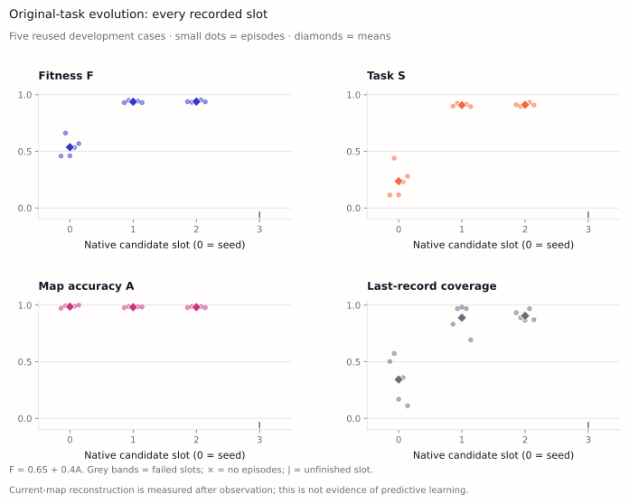
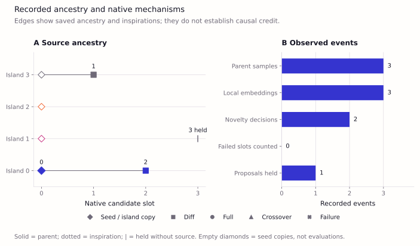
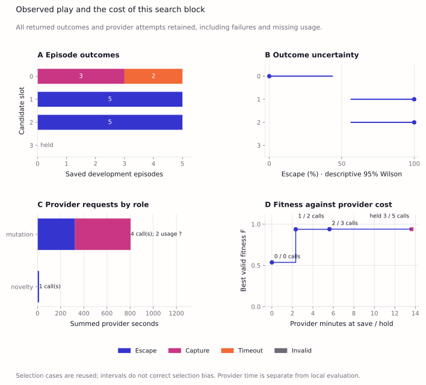
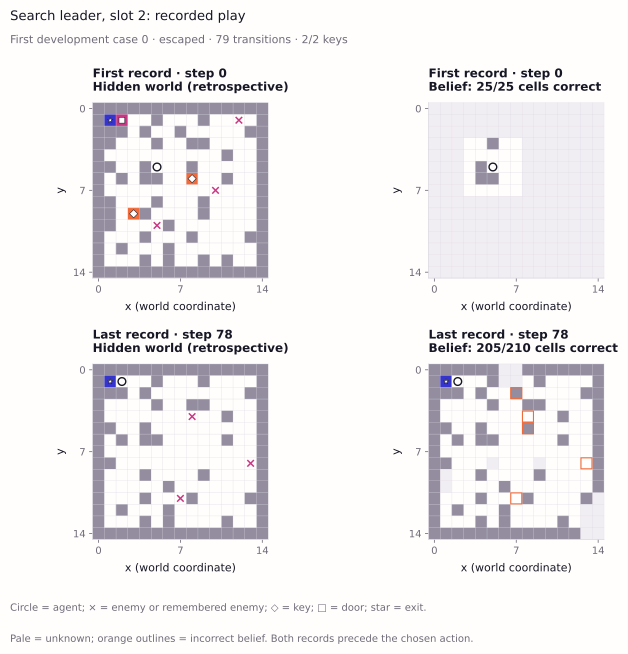
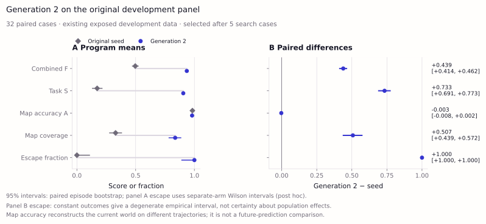
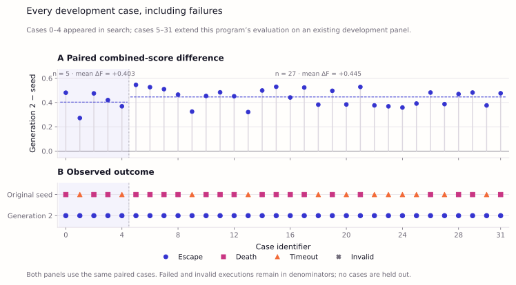

# ShinkaDreamer: Joint Evolution of Map Memory and Planning in a Partially Observed Dynamic Maze

*Scientific implementation report — original-proposal track. Search results are development evidence.*

## Abstract

We implement the original Sakana ShinkaDreamer proposal: evolve an executable
agent whose world-model updater integrates partial observations and whose planner
uses that internal map to navigate a dynamic maze. Selection combines task reward
and current-map reconstruction accuracy with the proposed weights of 0.6 and 0.4.
The implementation preserves the 15×15 maze,5×5 observation window, keys, gating
door, moving enemies and changing walls, with explicit repairs to the example
code's coordinates, mechanics and evaluator interface. In an initial development
characterization, the unevolved seed completed 32 valid episodes and escaped in
none;20 ended in capture and 12 timed out. Mean map accuracy was 98.31%, with 32.90%
mean final map coverage. These results characterize the starting agent and show
that accurate remembered cells alone do not establish successful navigation.
The first native ShinkaEvolve descendant escaped all five search cases. A subsequent
paired development check of generation 2 found **32/32 escapes versus 0/32 for the
seed**, including all 27 cases outside the five-case search panel. Mean fitness
rose from 0.4967 to 0.9353 and final map coverage from 32.90% to 83.64%; reported-cell
accuracy decreased slightly to 98.04%. The new 32-episode evaluation took 5.55
seconds and used no experiment-model calls. These results establish executable
program improvement on the exposed development panel; held-out performance,
causal benefits of particular memory mechanisms and discovery reliability remain
unmeasured.

## 1. Introduction

Partial observation makes memory and planning central to maze navigation. An
agent must retain information about previously observed passages and objectives,
reconcile that memory with a changing world, and choose actions using incomplete
knowledge. The [original Sakana proposal](docs/namazu-proposal.md) addresses this
problem by jointly evolving two Python functions:

```python
world_model_step(memory, local_obs, last_action) -> memory
planner(memory, local_obs) -> action
```

The scientific question is whether program evolution improves task performance
and internal-map quality through interpretable changes to these functions.
Possible changes include pathfinding, uncertainty, remembered enemy sightings,
exploration and replanning. Helpers and memory structures remain evolvable; this
is not restricted to scalar tuning or a fixed algorithm catalog.

Here, *world model* means the agent's maintained representation of the current
world. Future prediction and learning an unknown transition law are not required
by this experiment. ShinkaDreamer is not an implementation of neural Dreamer.
Earlier predictive-learning extensions are retained in a separate
[historical archive](docs/experiments-archive.md); none of their measurements or
figures is presented as evidence for this objective.

## 2. Methods

### 2.1 Environment and information boundary

The environment contains a 15×15 maze, two keys, a locked door gating the exit and
three anonymous enemies. The agent receives a 5×5 local observation. It chooses
one of nine attempted displacements, including waiting, and an interaction flag.
Enemies also draw uniform attempted displacements; blocked moves remain stays.
Walls change every 25 transitions and episodes end on capture, escape or the
200-transition horizon.

The implementation reuses the existing repaired maze. Border walls remain fixed,
layouts have feasible objective routes, diagonal corner cutting is disallowed,
and wall closures skip occupied cells. Interaction opens an adjacent cardinal
door before movement when both keys are held and collects a key at the movement
destination. Contact with an enemy before or after enemy movement is fatal.
These are explicit interpretations and repairs of the proposal's prose and
example, documented in [implementation details](proposal/README.md).

Candidates receive local observations, inventory, door state and observable
movement/interaction feedback. The hidden world, world seeds and scoring remain
inside the evaluator. The candidate runs in the existing restricted Python
process, with independent candidate randomness. No forecast interface, hidden
movement-law condition or prediction-learning intervention is imposed.

### 2.2 Initial program and joint evolution

The [initial program](proposal/initial.py) closely follows the proposal: integrate
observations into a persistent map, retain enemy sightings for five steps, move
greedily toward the nearest remembered objective, and otherwise wander randomly.
It has no engineered pathfinder or learned dynamics predictor. Repairs apply
actual displacement before map integration, maintain observable inventory and
door state, represent anonymous sightings, and permit interaction on a key
already under the agent.

The [native launcher](proposal/evolve.py) uses upstream ShinkaEvolve revision
[`9912af1`](https://github.com/SakanaAI/ShinkaEvolve/tree/9912af12d423504b8d580f4179fd15f5f88b8c50).
The proposal's nominal configuration has 100 total slots, four islands and five
development episodes per evaluated program. We implement it in separately reviewed
blocks. The first block has a six-slot ceiling, including the seed and failures,
30 actual provider calls across all roles, 1,200 summed provider seconds and a
40-minute invocation ceiling. It does not automatically continue toward 100 slots.

The [bounded launcher](proposal/evolve_full.py) retains native weighted parent
selection, archive/top inspirations, migration, diff/full/crossover operators,
reward-only model allocation, real local BGE embeddings, conditional novelty
judging, summaries/recommendations and prompt coevolution. Mutation allocation uses
Astra/high and Sol 6.1/high through the strict subscription route; all auxiliary
roles use that same route, and embeddings run locally. Configured mechanisms and
actual events are reported separately. See the
[frozen protocol](artifacts/proposal/full-native-01/protocol.json),
[staged plan](docs/original-proposal-plan.md) and
[source-level Shinka study](docs/shinkaevolve-research.md).

### 2.3 Original fitness

For an episode with length $T$, collected-key count $K$, door indicator $D$, escape
indicator $E$ and capture indicator $C$, the original task reward is

```math
S = \mathrm{clip}_{[0,1]}\!\left(\frac{0.1T+20K+30D+100E-50C+50}{250}\right).
```

After each observation and planning call, but before applying its action, the
evaluator compares the reported `believed_map` with current terrain and enemy
occupancy. Relative map coordinates are translated privately using the initial
agent position. Let $B_t$ contain the reported in-bounds cells at step t. Accuracy is

```math
A = \frac{\sum_t\sum_{x\in B_t}\mathbf{1}[\hat m_t(x)=m_t(x)]}
              {\sum_t |B_t|}, \qquad F=0.6S+0.4A.
```

An empty audit has $A=0$. Fitness is averaged equally over episodes; invalid
executions contribute zero and remain in the denominator. This is reconstruction
of the present after observation, not prediction of a future outcome. The
original positive step reward and reported-cell denominator are retained.
Coverage, escape, capture and timeout are reported separately rather than hidden
inside the composite score.

## 3. Initial experiment

Before execution, we fixed 32 development cases, numbered 0–31, and evaluated only
the initial program, with a maximum of 6,400 transitions. No fitting, candidate
selection or mutation-model calls were performed. These are development cases,
not a fresh assessment or evidence of generalization. The first case's replay
was selected by index before observing its outcome.

This 32-case characterization is separate from the launcher's five-case selection
default. Its score must not be imported as native search fitness; a search must
evaluate its seed and descendants on the same configured panel.

The [saved measurements](artifacts/proposal/initial-evaluation/metrics.json),
[per-episode data](artifacts/proposal/initial-evaluation/episodes.json) and
[source manifest](artifacts/proposal/initial-evaluation/manifest.json) support
all results and figures below. Every figure uses the shared
[Chromatic Fields style](docs/VISUAL_STYLE.md) and only this original-proposal
experiment's data.

## 4. Results

### 4.1 Initial seed characterization

| Measurement | Initial seed,32 episodes |
|:--|--:|
| Escape |0/32 (0%)|
| Capture |20/32 (62.5%)|
| Timeout |12/32 (37.5%)|
| Invalid execution |0/32|
| Mean task score $S$ |0.172325|
| Mean map accuracy $A$ |0.983149|
| Mean combined fitness $F$ |0.496655|
| Mean final map coverage |32.90%|
| Mean collected keys |0.53125|
| Opened door |0/32|
| Mean episode length |137.06 transitions|


**Figure 1. Initial-agent characterization.** All 32 episodes are included.
Outcome intervals are descriptive 95% Wilson intervals for the development panel;
score and accuracy panels retain individual episodes. Coverage is reported
independently of accuracy. These are results for one unevolved program, not an
evolutionary comparison or a held-out success estimate.


**Figure 2. Actual map memory in the first recorded episode.** The first and last
recorded pre-action states show evaluator truth alongside the agent's reported
map, translated into common coordinates. Hidden truth is a retrospective
visualization and was never supplied to the agent. Unknown map cells remain
visually distinct. This case ended in capture; the last displayed state precedes
the terminal action and is not a post-capture reconstruction.

Execution used 4,386 transitions. Summed measured episode wall time was 2.84 seconds
on the current host, including candidate execution; this excludes implementation,
tests and figure rendering. That initial characterization used zero experiment-model
calls. The subsequent search has its own measurements below.

### 4.2 First native evolutionary block

The search reused development cases 0–4 for every evaluated program. It reserved
four of the six permitted slots: the seed, two valid descendants and one unfinished
full-rewrite proposal. Both full-rewrite attempts timed out at the declared
240-second request boundary, triggering the prospective two-failure checkpoint.
No valid source or episode result exists for that reserved slot. Three additional
database rows are administrative island copies of the seed, not evaluated programs.

| Program | Episodes | Escape | Capture / timeout | Task $S$ | Accuracy $A$ | Fitness $F$ | Coverage | Mean steps |
|:--|--:|--:|:--|--:|--:|--:|--:|--:|
| Seed, slot 0 |5|0/5|3 / 2|0.236000|0.986904|0.536362|34.31%|150.0|
| [Generation 1](artifacts/proposal/full-native-01/programs/generation-001.py) |5|5/5|0 / 0|0.908240|0.982192|0.937821|88.89%|70.6|
| [Generation 2](artifacts/proposal/full-native-01/programs/generation-002.py) |5|5/5|0 / 0|0.910880|0.982193|0.939405|90.58%|77.2|
| Slot 3, unfinished rewrite |0|—|—|—|—|—|—|—|

All 15 executed episodes were valid, with 1,489 transitions. Generation 2 is the
search-fitness leader, not a held-out selected champion. Its paired mean fitness
gain over the seed is **0.403044**: the task term contributes **+0.404928** and the
accuracy term **−0.001884**. These gains are attributable to task performance in
the objective, not improved reconstruction accuracy.

Generation 2 exceeds generation 1 by only 0.001584 fitness. Almost all of that
difference comes from taking 6.6 more steps on average: the original objective
rewards elapsed steps. Both escape all five cases, so this ranking does not
establish superior navigation efficiency. We retain the proposed reward and
disclose this limitation.



**Figure 3. Search outcomes under the original objective.** Episode points and
program means use the same five development cases. The unfinished slot has no
invented score. Accuracy and coverage remain separate; these are selection data.

Both successful programs are direct seed mutations without inspirations.
They separate persistent terrain from transient enemy occupancy, add visit
history and frontier exploration, and replace direct target movement with
shortest-path planning through keys, door and exit. Their planners use accumulated
map memory and fixed danger estimates based on the known uniform enemy movement
rule. They also omit some stale dynamic cells from the scored map while retaining
them internally for navigation. This selective export and its denominator matter
when interpreting accuracy. No learned transition law or isolated causal effect
of memory is established by this code inspection.



**Figure 4. Actual native search activity.** Both mutation models were selected.
Real local embeddings and conditional novelty comparisons ran; one comparison
exceeded the 0.95 threshold and invoked the subscription-backed judge, which
accepted generation 1. Generation 2's similarity was below threshold and required
no judge. Neither result is a scientific novelty claim.

The full configuration was enabled, but this short execution did not exercise
every mechanism. Diff produced both valid descendants; full rewrite produced two
timeouts. No inspiration or crossover was used, no migration occurred, and no
summary, insight, recommendation or prompt-mutation provider call ran. The initial
prompt archive received native descendant credit; it did not evolve a new prompt.
Three programs remain pending in meta memory. At finalization the shared budget
gate rejected further dispatch after the two transport failures. We therefore
report a **partially exercised full-native configuration**, not a demonstration
of benefits from the complete machinery.



**Figure 5. Outcomes and computational cost.** Outcome intervals are nominal 95%
Wilson intervals on the development panel; 5/5 gives 56.6–100%. Reusing and
selecting on these cases prevents interpreting that interval as held-out
generalization evidence. Timed-out requests remain in resource totals; their
unreported tokens are unknown.



**Figure 6. Leader replay, development case 0.** The case is chosen by index,
not outcome. Evaluator truth and the reported map are shown retrospectively;
hidden truth was never supplied to the agent. All recorded replay frames and
nonwinning candidate sources are preserved in the
[compact results](artifacts/proposal/full-native-01/summary.json).

The controller ran for **846.11 seconds (14.10 minutes)**, excluding implementation
and reporting. Five provider requests consumed **818.03 seconds**: two successful
mutations, two timed-out rewrite attempts and one successful novelty judgment.
Reported usage from the three successful requests was 30,416 uncached input plus
output tokens and 36,864 cached input tokens. Usage for the two timeouts is unknown;
these are incomplete totals, not an estimate of subscription allowance.

The 15 episodes consumed **2.915 evaluator-plus-candidate CPU-seconds**, of which
2.110 were candidate CPU-seconds. Separately sampled controller and embedding
process CPU were 17.71 and 9.59 seconds; peak sampled combined resident memory was
1.09 GiB. The latter CPU samples are not a complete machine-wide resource audit.
Supervising-assistant work is additional and is not converted into a weekly
allowance percentage. Native API price estimates are not subscription charges.

The search is checkpointed with workers stopped. Its subsequent development
comparison is reported below. The historical assessments remain paused.

### 4.3 Paired 32-case development comparison

Before execution, the [Stage 3 protocol](artifacts/proposal/stage3-development/protocol.json)
nominated generation 2 because it led both search fitness and task score. Its
source, evaluator and limits were frozen. We evaluated it once on cases 0–31 and
reused the seed's saved results after verifying all seven evaluator/dependency
source hashes. No candidate was edited, no baseline was rerun and no model was
called. The five overlapping search cases reproduced every recorded outcome and
score exactly. Cases 5–31 are additional **development** cases, not a fresh or
held-out assessment; this panel was already exposed in the seed characterization.

| Measurement | Saved seed | Generation 2 | Paired difference |
|:--|--:|--:|--:|
| Escape |0/32|32/32|+100 percentage points|
| Capture / timeout / invalid |20 / 12 / 0|0 / 0 / 0|—|
| Mean task $S$ |0.172325|0.905300|+0.732975|
| Mean reconstruction $A$ |0.983149|0.980418|−0.002731|
| Mean fitness $F$ |0.496655|0.935347|+0.438692|
| Mean final map coverage |32.90%|83.64%|+50.74 percentage points|
| Mean keys / opened door |0.53125 / 0 of 32|2 / 32 of 32|—|
| Mean episode length |137.06|63.25|−73.81 transitions|

Generation 2 escaped 5/5 reused search cases and 27/27 additional development
cases. Its successful episodes lasted 25–130 transitions. The aggregate length
difference includes seed failures and is not an escape-speed comparison between
successful policies. The fitness gain decomposes into **+0.439785 from task reward**
and **−0.001093 from reconstruction**. Better task performance therefore persists
beyond the five search cases without improved reported-cell accuracy.

Descriptive paired 95% intervals are **[0.4137, 0.4623]** for the fitness gain,
**[0.6914, 0.7728]** for task score, **[−0.0075, 0.0021]** for reconstruction,
and **[43.93, 57.18] percentage points** for coverage. These intervals quantify
variation across the observed development cases; they do not correct selection
bias or establish performance on unseen cases.



**Figure 7. Development comparison, all 32 paired episodes.** Intervals use
10,000 whole-episode paired bootstrap resamples, preserving the original mean of
episode-level reconstruction ratios. The binary bootstrap degenerates when every
observed pair has the same escape difference; it cannot establish a perfect
population success rate. Separate nominal 95% Wilson intervals are 89.3–100% for
generation 2 and 0–10.7% for the seed. These post hoc boundary diagnostics do not
remove development exposure or candidate-selection bias.



**Figure 8. Every development case.** The five search cases and 27 additional
development cases are identified explicitly. The comparison preserves all outcomes
and uses the same environment case IDs. Reconstruction remains an on-policy
current-map measurement under different actions, not a matched-experience
prediction experiment.

The new evaluation executed **32 valid episodes and 2,024 transitions**, using
**5.55 seconds wall time and 5.45 total CPU-seconds**, including **4.45 candidate
CPU-seconds**. No new proposals, mutation calls or auxiliary model calls ran.
The seed's CPU usage was not measured in its initial characterization, so no
CPU speedup is inferred. Analysis, rendering and supervising-assistant work are
additional to these evaluation measurements. All episode data, a paired CSV,
uncertainty estimates and rendering provenance are in the
[Stage 3 results](artifacts/proposal/stage3-development/summary.json).

Stage 3 is complete and its workers have exited. The recommended next step is
Stage 4: compare the seed and both existing descendants on 64 disjoint
selection-validation cases, then freeze a selected program. Under the original
nomination rule, generation 2 leads $F$ and $S$, while generation 1 wins the
escape-count tie by its earlier generation. This would require **192 episodes,
zero model calls**, within the plan's 25-minute/800 CPU-second ceilings. No further
search is needed before that check. Stage 4 awaits a separate instruction.

## 5. Discussion and limitations

The seed accurately reconstructs the cells it reports, but it does not escape.
Its greedy planner can become blocked or pursue an unsuitable remembered target.
The initial characterization establishes room for behavioral improvement. The
subsequent search and 32-case paired check demonstrate improved task performance
on development cases. Search scores and broader development scores remain separate;
the latter are never imported into the five-case native fitness database.

The original accuracy term has specific limitations. An agent can obtain high
accuracy by retaining easy or recently observed cells while covering little of
the maze. Static terrain also contributes many targets. The 0.6/0.4 coefficients
do not guarantee balanced selection pressure, and the task reward gives a
positive contribution to elapsed steps. We disclose these properties while
preserving the requested objective. High composite fitness must not be described
as proof of understanding.

The first two successful descendants are direct seed mutations with no
inspirations. Their results therefore do not establish a benefit from accumulated
evolutionary history. Persistent memory is used by their planners, but the
contribution of mapping versus pathfinding versus risk heuristics is not isolated.
Independent discovery reliability, held-out performance and a causal benefit of
particular memory mechanisms remain unmeasured. The known uniform enemy law is
used as a heuristic; these results do not show learned transition dynamics.

## 6. Reproduction

Use the existing environment created by [bootstrap.sh](scripts/bootstrap.sh).
Run the focused correctness checks:

```bash
OPENBLAS_NUM_THREADS=1 .venv/bin/python -m unittest tests.test_proposal
```

Re-evaluate the initial program into a new directory:

```bash
OPENBLAS_NUM_THREADS=1 .venv/bin/python proposal/evaluate.py \
  --program_path proposal/initial.py \
  --results_dir results/proposal-reproduction --episodes 32 --replay-first
```

Regenerate the README figures from the saved experiment, without executing agents:

```bash
OPENBLAS_NUM_THREADS=1 .venv/bin/python proposal/figures.py
```

See [proposal/README.md](proposal/README.md) for preparation and explicit native
launch commands. The launcher defaults to preparation; `--run` is required for
model calls. No historical campaign or assessment is resumed by these commands.

Rebuild the Stage 1 figures from the committed compact evidence, without the
private runtime database or any new episodes/model calls:

```bash
OPENBLAS_NUM_THREADS=1 .venv/bin/python -m proposal.search_report --render-export
```

The original bounded invocation was `.venv/bin/python proposal/evolve_full.py --run`.
Its saved failure gate and deadline prevent further model work; this is not an
instruction to restart it. A future evolutionary continuation requires a new
explicit resource grant and reconciliation of the held pre-source slot. The
[run state](proposal/plan-state.json) records the exact boundary. The local native
dashboard can be reopened without model calls:

```bash
.venv/bin/python scripts/v3_webui.py \
  --campaign results/proposal-full-native-01 --port 8001
```

Rebuild the Stage 3 paired analysis and Chromatic Fields figures from saved data,
without running episodes or models:

```bash
OPENBLAS_NUM_THREADS=1 .venv/bin/python -m proposal.development_report
```

Reproduce the frozen generation-2 evaluation into a new directory:

```bash
OPENBLAS_NUM_THREADS=1 .venv/bin/python proposal/evaluate_full.py \
  --campaign-manifest artifacts/proposal/stage3-development/protocol.json \
  --program_path artifacts/proposal/full-native-01/programs/generation-002.py \
  --results_dir results/proposal-stage3-reproduction \
  --episodes 32 --seed-start 0 --record-first yes
```

These are reproduction commands, not an automatic continuation into Stage 4.

## References

1. Sakana ShinkaDreamer proposal. [Preserved original project description and example code](docs/namazu-proposal.md).
2. Lange, R.T., Imajuku, Y., and Cetin, E. *ShinkaEvolve: Towards Open-Ended and Sample-Efficient Program Evolution.* [Final ICLR 2026 paper](https://proceedings.iclr.cc/paper_files/paper/2026/file/7886b9bafe76c52fd568db10ff9772df-Paper-Conference.pdf); [official implementation](https://github.com/SakanaAI/ShinkaEvolve).
