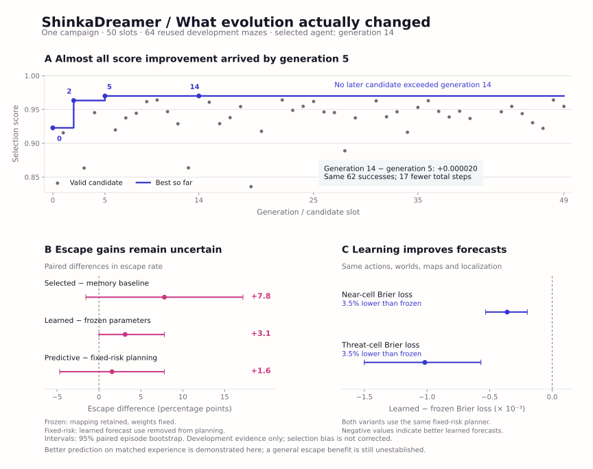
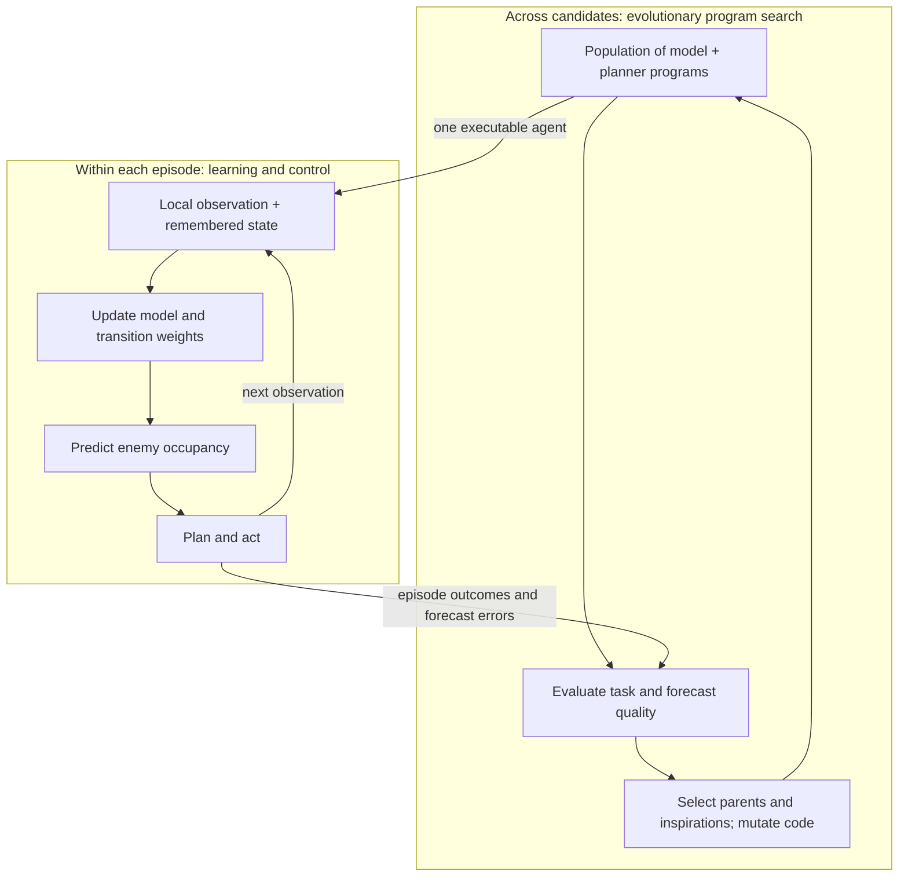

# ShinkaDreamer

**Evolving the code of agents that learn to predict and plan.**

An agent sees only a small patch of a changing maze. It must find two keys,
open a door and reach the exit while avoiding moving enemies. ShinkaDreamer
asks whether evolutionary program search can discover **both a better world
model and a better way to use it**.

There are two learning timescales: ShinkaEvolve changes the agent's Python
representation, learning rule and planner across candidates; the resulting
agent updates its predictive parameters from experience within each episode.
The first campaign evolved a spatial enemy-motion model and a planner that
reasons about survival over two actions.

The project began with a proposal from **Sakana AI's Namazu**, supplied by
Roland Löchli. The [complete original proposal](docs/namazu-proposal.md) is
preserved. This independent experiment currently uses symbolic and statistical
world models rather than the neural Dreamer architecture.

[Findings](docs/campaign-findings.md) · [Inside the evolved agent](docs/evolved-agent.md) ·
[Protocol](docs/protocol.md) · [Selected program](artifacts/campaign-v2/completed-50/selected.py) ·
[Reproduce](docs/reproduction.md)

## Watch the evolved agent


In this development episode, the agent collects keys at steps **13** and **39**,
experiences wall changes at **25** and **50**, opens the door at **58**, and
escapes on action **59**. By step 50 it has performed 19 parameter-update steps.
The panels expose the hidden world, the agent's remembered terrain and its
enemy-occupancy forecast. Hollow circles on the forecast panel show subsequent
enemy positions for retrospective comparison; the agent never receives them.
[Replay data](artifacts/campaign-v2/mechanism-gen14/replay/replay.json).

## What the first campaign found

**Evolution improved development performance, and the evolved model benefits
from online learning. Whether that learning reliably improves decisions on
fresh mazes remains the central open question.**

| Research question | Evidence | Interpretation |
|---|---|---|
| Did program evolution improve the agent? | Selected program: **62/64 escapes**, seed: **56/64**, memory/pathfinding baseline: **57/64** | Better performance on reused development cases; fresh-case performance is unmeasured. |
| Does the evolved model learn from experience? | With identical actions and observations, learned weights reduce near-cell Brier loss by **3.49%** relative to frozen weights. | A measurable predictive benefit from within-episode updates. |
| Does learned prediction improve control? | Freezing weights changes escapes from 62 to 60; substituting fixed-risk planning changes them from 62 to 61. | The differences are too uncertain to establish a reliable escape benefit. |



All positive results above use the same **64 development mazes**, including a
post-selection intervention audit. Confidence intervals describe variation
across those cases; they do not remove selection bias. The evolved agent has
not undergone a fresh final assessment. One campaign also cannot establish
the repeatability of the search method.

## How evolution and learning fit together



The evolutionary unit is a **program**, not a vector of fixed hyperparameters.
Both `world_model_step(memory, local_obs, last_action)` and
`planner(memory, local_obs)`, along with their helpers and representations,
can change. Native ShinkaEvolve supplies four islands, parent and inspiration
sampling, an archive, migration and recommendations. LLM-generated code
mutations propose the changes; local simulation measures them.

Inside an episode, the selected agent maintains terrain, observation ages,
position and uncertain enemy occupancy. Ten learned weights determine how
enemy probability mass moves between nearby cells. New observations supply
training labels, and Brier-loss gradients update those weights using AdaGrad.
Memory and weights reset at the next episode.

The planner combines risk-weighted paths with two-action lookahead. Its most
interesting refinement is to ask: **if I survived the first move, which enemy
locations have just been ruled out?** Generation 14 preserves alternative
destinations for each anonymous source and conditions the next risk estimate
on that survival event. The resulting forecast is an approximation, with
heuristic risk costs, rather than an exact simulator of the entire world.

[The agent walkthrough](docs/evolved-agent.md) explains the transition model,
learning equations, planning intervention and source functions in detail.

## What actually evolved

The selected program descends through **0 → 2 → 5 → 14**.

| Candidate | Change in representation or behavior | Escapes /64 | Selection score |
|---|---|---:|---:|
| [Seed](artifacts/campaign-v2/completed-50/lineage-programs/gen_0.py) | Categorical occupancy estimates and risk-weighted pathfinding | 56 | 0.922806 |
| [Generation 2](artifacts/campaign-v2/completed-50/lineage-programs/gen_2.py) | Learned mixture of stationary, cardinal and diagonal motion fields; revised hazard and waiting behavior | 61 | 0.963307 |
| [Generation 5](artifacts/campaign-v2/completed-50/lineage-programs/gen_5.py) | Spatial softmax learner, hidden occupancy propagation, inferred motion, two-step planning and revised exploration | 62 | 0.970029 |
| [Generation 14](artifacts/campaign-v2/completed-50/lineage-programs/gen_14.py) | Preserved source alternatives and survival-conditioned continuation risk | 62 | 0.970050 |

These changes show that the search explored learning algorithms and planning
structure. They do not isolate the contribution of each individual code change.

**The plateau is part of the result.** Generation 5 already accounts for more
than 99.9% of the eventual best-score gain. Generation 14 solves exactly the
same 62 cases and uses 17 fewer total steps across the 64 episodes. No later
candidate beats it. The completed campaign contains 50 slots: the seed,
45 valid descendants and four failed descendants. Failed slots remain in the
record and are not replaced to improve the results.

There is also a useful tension between the objectives. From the seed to the
selected program, the score increases by **0.047243**: the weighted task term
contributes **+0.047527**, while the model term contributes **−0.000283**.
The highest model-score candidate, generation 20, escapes only **55/64** mazes.
A high forecast score and a strong policy are different achievements.
Because candidates visit different states, their on-policy forecast losses
cannot identify which model learns better.

[Full campaign analysis](docs/campaign-findings.md) ·
[Every candidate's metrics](artifacts/campaign-v2/completed-50/generation-metrics.json) ·
[Lineage and inspirations](artifacts/campaign-v2/completed-50/lineage.json) ·
[Episode rows](artifacts/campaign-v2/completed-50/episodes.csv)

## Separating learning from behavior

A useful forecast must be made before the outcome. A useful learning
comparison must also control what the agent experiences. Otherwise a lower
prediction loss might simply mean that the agent took an easier route.

The selected program was evaluated under a **2 × 2 intervention**: update or
freeze its predictive weights, and use learned forecasts or a fixed local-risk
heuristic for planning. Mapping and localization remain active in every
condition. Fixed-risk planning still performs pathfinding and lookahead; it
substitutes the hazard estimate rather than removing the planner.

| Selected program / intervention | Escapes /64 | Near-cell Brier ↓ | Threat-conditioned Brier ↓ |
|---|---:|---:|---:|
| Learn + predictive planning | 62 | 0.009565 | 0.027742 |
| Freeze weights + predictive planning | 60 | 0.010328 | 0.028723 |
| Learn + fixed-risk planning | 61 | 0.009960 | 0.028139 |
| Freeze weights + fixed-risk planning | 61 | 0.010320 | 0.029156 |

The last two conditions produce **identical world/action trajectories and
map/localization hashes on all 64 cases**. Their loss difference isolates
predictive updating under that fixed policy: near-cell Brier changes by
**−0.000360**, with a paired 95% bootstrap interval of
**[−0.000531, −0.000199]**. Learned weights change in 61 episodes; frozen
weights never change. The aggregate gain is not universal: episode-level near
loss improves in 39 cases, ties in four and worsens in 21.

The escape evidence is less decisive. Learning versus frozen weights changes
escape by **+3.1 percentage points [0.0, +7.8]**; predictive versus fixed-risk
planning changes it by **+1.6 points [−4.7, +7.8]**. The full evolved program's
advantage over the original memory baseline is **+7.8 points [−1.6, +17.2]**.
These comparisons leave room for both useful effects and little or no benefit.

[Intervention audit](artifacts/campaign-v2/mechanism-gen14/audit-summary.json) ·
[Trajectory checks](artifacts/campaign-v2/mechanism-gen14/trajectory-audit.json) ·
[Paired data](artifacts/campaign-v2/mechanism-gen14/episodes.csv)

## The world and the measurement

The environment is a **15 × 15 maze** observed through a **5 × 5 local square**.
There are two keys, one locked exit door, three moving enemies, wall changes
every 25 steps and a 200-step horizon. Nine actions include waiting; diagonal
corner cutting is forbidden. The door physically gates the exit, and every
wall phase retains connected routes. The evaluator owns hidden state and
independent layout, enemy and audit random streams.

Enemy movement draws from a fixed uniform distribution over the nine attempted
displacements; blocked moves become waits. Thus the current agent learns
terrain-dependent occupancy dynamics, not pursuit or changing enemy behavior.
It remembers and refreshes walls but **does not learn their change schedule**.
These properties delimit what this first environment can demonstrate about
adaptive world models.

The selection objective is `0.6 × task + 0.4 × model`. Task combines escape,
keys, door opening and successful-escape time. Model quality is one minus the
mean of near-cell and uniform-audit Brier losses for one-step enemy occupancy.
Empty cells are common, so the model score alone is easy to overinterpret;
task outcomes and threat-conditioned losses are retained separately.

This forecast objective and online transition learning are explicit extensions
to Namazu's original reconstruction-based proposal. The
[protocol](docs/protocol.md) records the exact formula, observation contract,
environment repairs and evaluation boundaries. Candidate code runs in a
restricted worker; it receives observations, not a live environment or hidden
assessment seeds.

## The next scientific question

**Does the selected model's predictive improvement produce safer decisions on
fresh mazes?** The next assessment should compare the frozen selected program
with its audited interventions and the original competent baseline on the same
fresh cases, with escape as the primary outcome. This tests the agent already
discovered; more search on the same development set would not answer it.

After that assessment, a separately labeled dynamics-shift experiment could
test adaptation to changes in enemy motion. A wall-prediction experiment could
test anticipation rather than map refresh. Both would preserve the original
maze and unrestricted joint program search while putting more direct pressure
on the world-model hypothesis. They are research directions, not completed
results. The evolved agent's final held-out pool remains unreserved and unevaluated.

## Explore and reproduce

The compact evidence is committed, so the curves and analysis can be regenerated
without a model call or a new maze evaluation:

```bash
python scripts/research_figure.py
```

This requires NumPy and Matplotlib. Local candidate evaluation needs Linux,
Python 3.10, Landlock and libseccomp; it needs neither a GPU nor a model API.
The [reproduction guide](docs/reproduction.md) covers installation, development
evaluation and full-run exports. The [execution record](docs/execution-history.md)
holds upstream revisions, subscription routing, failed-slot details and recovery
provenance. The earlier [seed study](docs/seed-study.md) preserves its negative
held-out result as a separate experiment.

The current research state and scope are recorded in [CODEX_TASK.md](CODEX_TASK.md).
