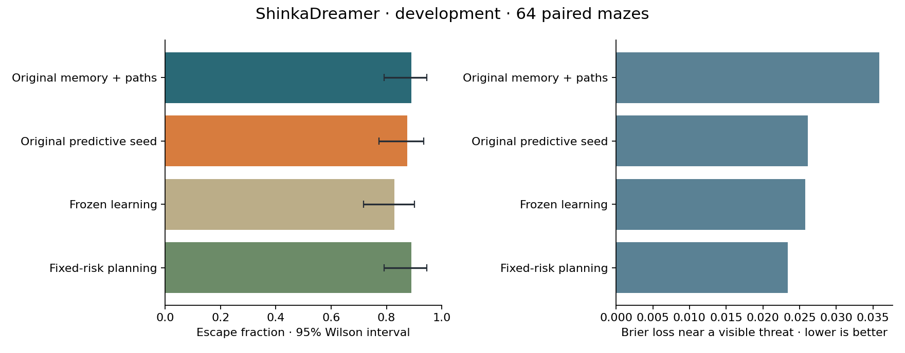
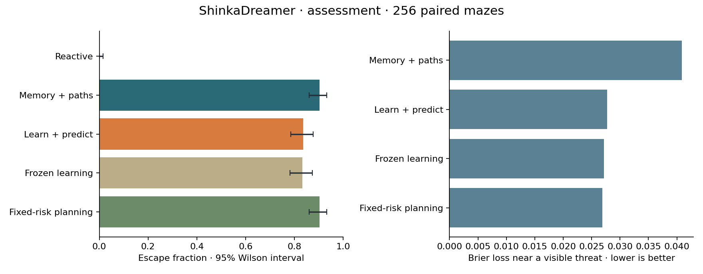
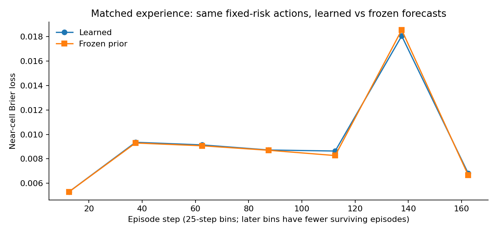
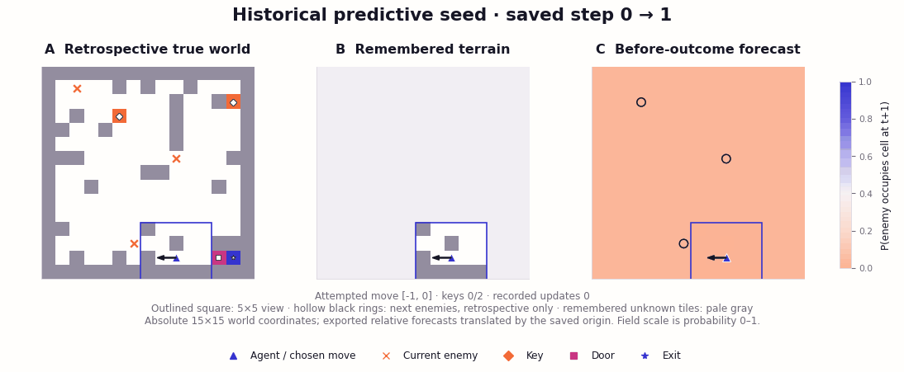

# ShinkaDreamer

**A running experiment in learned prediction and planning in partially observed, changing mazes.**

The first experiment is implemented and measured. Its negative result matters: on
256 withheld mazes, the predictive seed escaped **83.6%**, versus **90.2%** for a
competent memory/pathfinding baseline. Online updates changed the model but did
not improve its predictions over the frozen prior on matched experience.

**Evolution remains blocked: zero descendants generated or evaluated.** The v2
follow-up repaired control preservation, candidate initialization and campaign
provenance, then made exactly one subscription-runtime probe. Codex still failed
before inference in its outer app-server with `Read-only file system (os error 30)`.
The original v1 checkpoint contains one unique evaluated seed and four island rows;
v2 has a frozen configuration and development pool, but no native database yet.
No paid model or embedding calls were used. Exact WSL commands appear below.

The starting proposal was supplied by Roland Löchli and attributed by him to
Sakana AI's Namazu model. Its full text is preserved unchanged in
[docs/namazu-proposal.md](docs/namazu-proposal.md). This independent project does
not imply endorsement by Sakana AI or implement neural DreamerV3.

## Question and implemented agents

Can joint program evolution discover world-model updates and planners whose
experience-derived predictions improve decisions in unfamiliar changing mazes?

The repaired environment retains a 15×15 world, 5×5 local square view, two keys,
a door that physically gates the exit, three wandering enemies, changing walls
every 25 steps and a 200-step horizon. Localization uses actual movement feedback;
diagonal corner cutting is blocked; occupied wall closures are skipped; generated
objectives remain reachable in every wall phase. The evaluator owns hidden state,
RNGs, forecast targets and scoring. A per-episode Python worker is restricted by
Linux Landlock and seccomp before candidate code executes.

The memory baseline combines frontier exploration, Dijkstra pathfinding, inventory
tracking and conservative local enemy avoidance. The predictive seed adds online
Beta-style occupancy-transition estimates, conditioned on current enemy proximity
and local terrain. It uses their probabilities in path costs and move-versus-wait
choices. Memory and model parameters reset each episode. Both `world_model_step()`
and `planner()`, including representations, learning rules and helpers, remain
inside the evolve block in [initial.py](initial.py).

Prediction learning is an extension to the proposal. Local terrain/enemy layers,
feedback, generation and action-order choices are documented separately from bug
repairs in the [executed protocol](docs/protocol.md). The seed predicts one-step
enemy occupancy; it does not yet learn wall schedules or simulate multi-step futures.

## Campaign v2: controls and execution

The maze, objective and freely evolvable agent are unchanged. The original programs
from `1ce4fb7` are now preserved under [controls/v1](controls/v1/manifest.json), with
hash checks before use. `memory` always executes the original memory/pathfinding
program; `original_predictive` always executes the original predictive seed.
Neither comparison can silently become a flag applied to an evolved program.

Python now starts with `-s -S`, an explicit standard-library import path and
`PYTHONHASHSEED=0`. The independent agent RNG is seeded **before candidate source
executes**. Landlock, seccomp and resource limits are unchanged. A stochastic
candidate using import-time random draws, string hashes/set traversal and later
random actions produced identical traces across six fresh processes
([probe and trace hashes](artifacts/campaign-v2/reproducibility.json)).

The v2 check ran **320 condition-episodes** on the original 64 development mazes:
predictive **56/64**, memory **57/64**, frozen learning **53/64**, both fixed-risk
planning variants **57/64**. Every scientific episode field matched v1 exactly,
excluding timings and renamed labels. The native evaluator separately repeated
the seed's 64 episodes and **0.922806** score. These are replication checks, not
new evidence of generalization or evolution.



On matched fixed-risk experience, learned versus frozen near-cell Brier was
**0.006864 vs 0.006819**; threat-conditioned Brier was **0.023394 vs 0.023197**.
The paired near-loss difference was +0.0000454 [−0.0000162, +0.0001003]. There is
no demonstrated learning benefit here. The predictive seed made 350.1 updates per
episode; freezing left mapping and localization working and made zero predictive
updates. [Full task/forecast results and uncertainty](artifacts/campaign-v2/controls/summary.json)
and the [matched learning curve](artifacts/campaign-v2/controls/learning.png) are retained.

[Campaign manifest](artifacts/campaign-v2/campaign-manifest.json),
[resolved settings](artifacts/campaign-v2/dreamer-resolved.json),
[single failed probe](artifacts/campaign-v2/subscription-probe.log) and
[counts/status](artifacts/campaign-v2/status.json) record the exact inputs and blocker.
The driver rejects configuration drift and refuses to append repaired scores to
`campaign-v1`. All original result artifacts, its database and its final seed pool
remain byte-identical. Fresh v2 assessment cases have **not** been drawn: selection
and evolved-mechanism ablation checks require a real descendant first.

## Published v1 results (preserved)

The seed was fixed before validation and final assessment. Development used 64
paired mazes; validation used a separate 64; assessment used 256 fresh mazes
reserved after mutation attempts stopped. There were **2,240 condition-episodes**
across these comparisons, excluding integration checks and replays. This is one
handwritten seed experiment, not evidence of evolutionary improvement.

| Agent / intervention | Escapes, /256 | Escape rate [95% interval] | Death rate | Steps per escape | Near-cell Brier ↓ |
|---|---:|---:|---:|---:|---:|
| Reactive local movement | 0 | 0.0% [0.0, 1.5] | 78.5% | — | 0.25000¹ |
| Memory + paths | 231 | 90.2% [86.0, 93.3] | 9.8% | 61.8 | 0.01167² |
| Learned prediction + planning | 214 | 83.6% [78.6, 87.6] | 16.4% | 55.7 | 0.00737 |
| Freeze predictive updates | 213 | 83.2% [78.1, 87.3] | 16.8% | 50.7 | 0.00696 |
| Learn, use fixed-risk planning | 231 | 90.2% [86.0, 93.3] | 9.8% | 61.8 | 0.00767 |

¹ Missing forecasts receive the declared 0.5 default, hence 0.25 loss.
² The memory control reports the evaluator's persistence forecast.
Only the reactive agent timed out (21.5%); all other episodes ended in death or
escape. Brier losses in this table are on each policy's own trajectory, so their
comparison alone does not isolate learning. Successful-escape times are conditional
on success and should not be interpreted as an unconditional efficiency advantage.



Using learned predictions in planning reduced escape by **6.6 percentage points**
versus the competent baseline / no-prediction-planning control (paired 95% bootstrap
interval **−12.5 to −0.8 points**). Learning versus frozen updates changed escape
by **+0.4 points [−5.5, +6.3]**: no demonstrated benefit. Freezing leaves localization,
map integration, inventory and ordinary memory functioning.

On **identical baseline actions and observations**, learned forecasts had near-cell
Brier **0.007673**, versus **0.007635** for frozen priors: a small deterioration of
**0.0000375 [0.0000102, 0.0000625]**. Both beat persistence (**0.011669**) and the
fixed 0.02 base forecast (**0.008867**). Thus beating persistence is attributable
to the predictive representation/prior here; it does not demonstrate useful online
learning. The matched threat-conditioned losses were 0.026867 learned, 0.026692
frozen and 0.040866 persistence. Uniform-audit loss was 0.017113 learned versus
0.017103 frozen; the full assessment components are retained.



The predictive seed made **356.7 observation-based parameter updates per episode**
on average; the fixed-planning learner made 400.0. Later curve bins contain fewer,
longer surviving episodes. They do not establish an unconditional learning trend.

Development escapes were 56/64 predictive versus 57/64 baseline. Validation was
41/64 versus 58/64. We retained that regression and did not tune on validation or
assessment. Escape intervals use Wilson's method; difference intervals use 5,000
paired episode-bootstrap samples. These intervals describe case variability, not
repeatability across evolutionary campaigns.

Compact evidence: [assessment](artifacts/assessment/summary.json),
[paired episode rows](artifacts/assessment/episodes.csv),
[development](artifacts/development/summary.json),
[validation](artifacts/validation/summary.json).
Task, model, coverage, reconstruction, keys, door, timing and ablation metrics remain
separate. The scalar selection objective is versioned `task06-forecast04-v1`:
`.6 * task + .4 * (1 − mean(near Brier, audit Brier))`; it replaces the draft's
post-observation reconstruction term. High model scores mostly reflect empty cells.

## Replays

The evaluator records the hidden world, exported memory, forecasts and selected
action before each transition. Hollow circles on the forecast panel show the
subsequent enemy locations for retrospective auditing; the agent never sees them.



This development episode escapes in 60 steps and contains both scheduled wall
changes. Its [recorded frames](artifacts/replay-success/replay.json) include the
changing learned rates. The [failure replay](artifacts/replay-failure/replay.gif)
shows validation maze 20000: the seed dies on step 7 while the memory baseline
escapes. Both visualizations were inspected. No withheld maze states are published.

## Native integration and the historical v1 checkpoint

The installed upstream revision is
[`9912af1`](https://github.com/SakanaAI/ShinkaEvolve/tree/9912af12d423504b8d580f4179fd15f5f88b8c50).
Its native evaluator contract, named CLI arguments, callback expansion, output
serialization and prompt feedback were exercised. The seed's native development
score was **0.922806**. Four persisted rows are the evaluated seed and three island
copies, not four independent evaluations. There is no evolution curve to report.

Mutation and the separate recommendation client use only
`headless/codex@gpt-6-astra?effort=high` with `HEADLESS_BILLING=subscription`.
The official Headless source was pinned to
[`93cd9b0`](https://github.com/RobertTLange/headless-cli/tree/93cd9b06b85f848af1308c41e018991b33907c5e),
because the installed npm release lacked that billing control. API credentials are
removed from the child environment. Embeddings and novelty LLMs are disabled;
embedding-based novelty is unavailable. One model configuration is not a model
bandit experiment. Recommendations retain their native interval/final flush but
none completed successfully.

The actual startup error was:

```
failed to initialize in-process app-server client: Read-only file system (os error 30)
```

The existing login reported ChatGPT authentication. No authentication, global Codex
settings or permission policy was changed to work around this error. The driver
now fails early on a blocked subscription probe. Native parent/inspiration
sampling, islands, archive, lineage and migration remain configured. A narrow
seed-only resume fix was verified against a real SQLite backup without duplicating
rows. Details: [runtime audit](docs/upstream.md), [resolved settings](artifacts/native/resolved.json),
[lineage](artifacts/native/lineage.json), [execution status](artifacts/native/status.json).

## Run and resume

Linux with Python 3.10, Landlock, libseccomp, Node 22+ and an existing authorized
subscription login is required. Evaluation needs no network or GPU.

```bash
# Fresh local dependency installation; no global configuration changes.
bash scripts/bootstrap.sh

# Local paired experiment and native evaluator contract (new output paths).
.venv/bin/python -m pytest -q
python3 scripts/experiment.py --episodes 64 --out results/development-v2
.venv/bin/python evaluate.py --program_path controls/v1/predictive.py --results_dir results/native-seed-v2

# Ordinary WSL terminal: first obtain a generated, evaluated descendant.
cd /home/roland/projects/shinka-dreamer
HEADLESS_BILLING=subscription .venv/bin/python scripts/evolve.py \
  --results results/campaign-v2 --generations 2

# After confirming an evaluated descendant, continue the same native campaign.
HEADLESS_BILLING=subscription .venv/bin/python scripts/evolve.py \
  --results results/campaign-v2 --generations 100
```

Generation-stop requests are recorded separately from the immutable 100-slot
campaign configuration, so the two commands share the same evaluation identity.
The campaign uses one evaluation worker, four islands and native SQLite persistence
after every candidate. The target counts the seed slot plus 99 subsequent slots;
failed slots and accepted/evaluated descendants are distinct. On this host the
256 predictive assessment episodes took about 47 seconds in total; launch and
model latency remain separate. The native database, logs and raw private seeds are
kept locally under ignored `results/`. Compact evidence is committed under
`artifacts/`; credentials, virtual environments and runtime caches are excluded.

After evolution, inspect the selected descendant's updating and planning code.
Verify that freezing removes its predictive updates without disabling mapping and
that disabling predictive planning removes its actual use of predictions. Compare
learned/frozen forecasts on identical observations and executed actions; flags and
better on-policy Brier alone are insufficient. Improved fixed rules are a valid
result, but do not demonstrate improved online learning. These descendant checks
remain pending because no descendant was generated.

Then reserve **fresh** final cases, using the selected native program's exact path
(the example assumes `best/main.py` is a descendant). The command freezes its hash
and native ID before generating the private pool:

```bash
.venv/bin/python scripts/experiment.py --split assessment --episodes 256 \
  --campaign results/campaign-v2 --program results/campaign-v2/best/main.py \
  --assessment-seeds results/private/campaign-v2-assessment-seeds.json \
  --reserve-assessment --out results/campaign-v2-assessment
```

The pool hash is recorded in both campaign assessment and experiment manifests.
Resume with the same command; selection, pool and evaluation hashes must agree.
The published v1 pool is preserved and cannot be silently reused. See
[CODEX_TASK.md](CODEX_TASK.md) and [AGENTS.md](AGENTS.md) for the
durable handoff; these instructions do not automatically exist in another Codex
installation.

The next scientific question is whether uncertainty-aware enemy-transition models
and risk-sensitive planning can improve escape over the strong memory baseline,
without confusing accurate empty-cell predictions with useful decisions.
