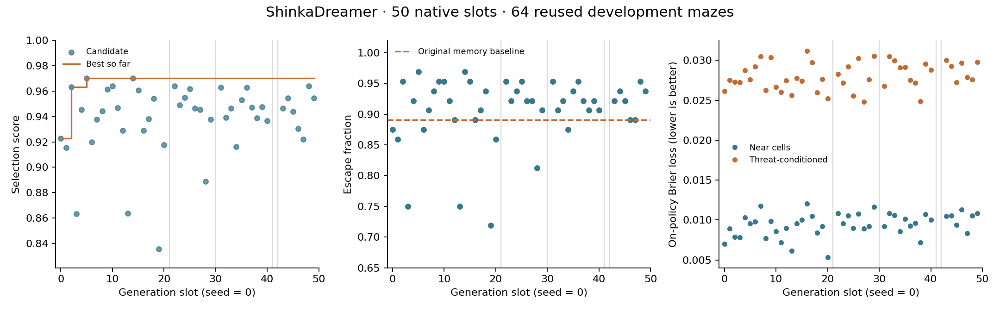
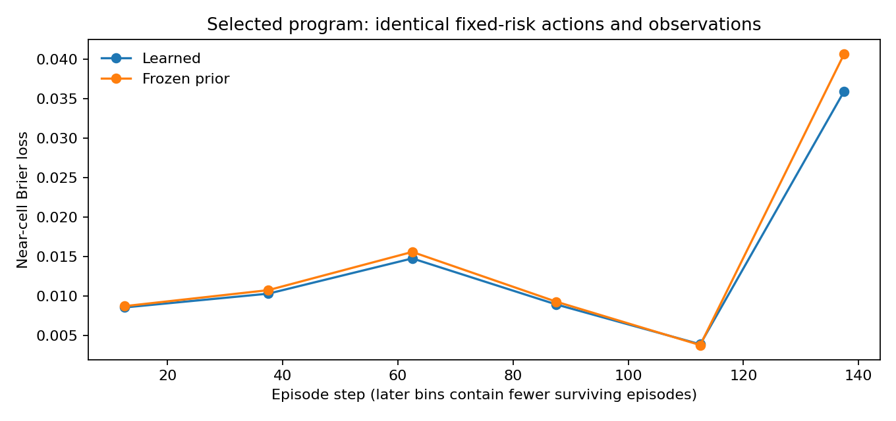

# ShinkaDreamer

**Joint evolution of learned prediction and planning in partially observed, changing mazes.**

The recovered native ShinkaEvolve campaign has completed **50 total generation
slots (0–49)**: one seed, 45 valid descendants and four failed descendant slots.
Generation 14 remains the best; the resumed search did not beat the saved leader.
It escapes **62/64 development mazes (96.9%)**, versus **57/64 (89.1%)** for the
original memory/pathfinding baseline. The paired advantage is **+7.8 percentage
points [−1.6, +17.2]**. These are reused search cases, not a generalization result.

The evolved model does show a narrower, measurable benefit: on identical
trajectories, updating its transition weights reduces near-cell forecast Brier
loss by **3.5%** relative to frozen weights. Whether that learning improves escape
on fresh mazes remains unresolved. **The final held-out assessment is untouched:**
the published v1 assessment and its private pool are preserved, and no v2 final
pool has been reserved or evaluated.

The starting proposal was supplied by Roland Löchli and attributed by him to
Sakana AI's Namazu model. Its full text is preserved unchanged in
[docs/namazu-proposal.md](docs/namazu-proposal.md). This independent project does
not imply endorsement by Sakana AI or implement neural DreamerV3.

## The experiment

Can program evolution discover world-model updates and planners whose
experience-derived predictions improve decisions in unfamiliar changing mazes?

The environment retains a 15×15 world, 5×5 local square view, two keys, a door
that physically gates the exit, three moving enemies, changing walls every
25 steps and a 200-step horizon. Repairs prevent diagonal corner cutting and
occupied wall closures, preserve objective reachability in every wall phase,
and provide actual movement feedback. Prediction learning is an explicit
extension to the original proposal; [the protocol](docs/protocol.md) separates
that extension and observable-interface choices from correctness repairs.

Both `world_model_step()` and `planner()`, their representations, update rules
and helpers are freely evolvable Python in [initial.py](initial.py). The evaluator
owns hidden state, independent layout/enemy/audit RNG streams and forecast
scoring. Each episode runs candidate code in a separate Landlock/seccomp worker
with 192 MiB memory, 10 CPU seconds and a three-second response limit. Resource
limits constrain execution, not the permitted algorithms. Parameters and memory
reset each episode.

The selection score is `.6 * task + .4 * model`, versioned
`task06-forecast04-v1`. Task measures escape, keys, door opening and successful
escape time. Model quality measures one-step enemy-occupancy forecasts made
before the world advances. Outcomes, near-cell Brier, uniform-audit Brier and
threat-conditioned Brier are reported separately. Most cells are empty, so a
high model score alone says little about useful prediction. The score averages
per-episode losses; published Brier diagnostics pool prediction targets.

## Completed native campaign



The campaign contains 49 generated descendant programs, 45 valid descendants,
and 53 database rows: the seed has four native island copies. Failed slots count
toward the requested 50. There are 48 saved 64-episode evaluations, including two
invalid candidates, for **3,072 native condition-episodes**. The figure shows valid
candidates and marks failed slots with gray lines. Its forecast losses are on
each policy's own trajectories and do not isolate learning.

The best selection score rises from **0.922806** at the seed to **0.970050** at
generation 14, then plateaus. Most of the gain was already present by generation 5.
Its parent chain is **0 → 2 → 5 → 14**. The mutations
introduce learned motion mixtures, a spatial softmax transport model and two-step
planning that conditions future enemy occupancy on surviving the first move.
These are substantive program and representation changes, not a parameter grid.
Exact [selected code](artifacts/campaign-v2/completed-50/selected.py),
[ancestor programs](artifacts/campaign-v2/completed-50/lineage-programs),
[lineage and inspirations](artifacts/campaign-v2/completed-50/lineage.json),
[per-generation metrics](artifacts/campaign-v2/completed-50/generation-metrics.json)
and [paired results](artifacts/campaign-v2/completed-50/summary.json) are committed.

| Program / intervention | Escapes /64 | Escape rate [95% interval] | Near-cell Brier ↓ | Threat Brier ↓ |
|---|---:|---:|---:|---:|
| Original memory + paths | 57 | 89.1% [79.1, 94.6] | 0.01053 | 0.03589 |
| Original predictive seed | 56 | 87.5% [77.2, 93.5] | 0.00699 | 0.02613 |
| Evolved generation 14 | 62 | 96.9% [89.3, 99.1] | 0.00957 | 0.02774 |
| Generation 14, frozen weights | 60 | 93.8% [85.0, 97.5] | 0.01033 | 0.02872 |
| Generation 14, fixed-risk planning | 61 | 95.3% [87.1, 98.4] | 0.00996 | 0.02814 |
| Generation 14, frozen + fixed-risk | 61 | 95.3% [87.1, 98.4] | 0.01032 | 0.02916 |

All rows use the same 64 development cases. Original controls are immutable
[versioned programs](controls/v1/manifest.json), not flags applied to evolved code.
The seed's lower on-policy Brier does not establish a better learner: its actions
and visited states differ. Escape intervals use Wilson's method; difference
intervals use 5,000 paired whole-episode bootstrap samples. They describe case
variability, do not correct for search/selection bias and do not measure
repeatability across independent campaigns. Only one search campaign was run.

## What the evolved agent learns

Generation 14 predicts anonymous enemy occupancy by transporting probability mass
through local terrain. Ten learned softmax weights combine geometry, proximity,
approach and inferred motion features. Brier gradients with regularization and
AdaGrad updates learn from consecutive local observations. Its planner evaluates
two-step continuations using survival-conditioned enemy alternatives. Mapping,
localization and occupancy filtering continue when predictive weights are frozen;
the agent does not learn a wall-change clock.

A separate **256-condition-episode development audit** checked the executable
interventions. With fixed-risk planning, learned and frozen variants have exactly
matching world/action/enemy trajectories and map/localization hashes on all 64
cases. Learned weights change in 61 episodes; frozen weights change in none and
perform zero parameter updates. The [predictive replay check](artifacts/campaign-v2/mechanism-gen14/repeatability.json)
reproduces every original scientific episode field for generation 14, apart from
timing and audit fields.

On that matched experience, near-cell Brier is **0.009960 learned versus 0.010320
frozen**, a difference of **−0.000360 [−0.000531, −0.000199]**. Threat-conditioned
Brier improves by **−0.001017 [−0.001501, −0.000569]**. This is evidence of useful
within-episode predictive updating on development cases. The predictive agent
makes 351.3 label updates through 14.0 parameter-update steps per episode on average.



Late bins contain fewer, longer-surviving episodes; they do not establish an
unconditional learning trend. See the [audit and intervals](artifacts/campaign-v2/mechanism-gen14/audit-summary.json),
[trajectory checks](artifacts/campaign-v2/mechanism-gen14/trajectory-audit.json)
and [paired episode rows](artifacts/campaign-v2/mechanism-gen14/episodes.csv).

Learning versus frozen weights changes escape by **+3.1 points [0.0, +7.8]**;
predictive versus fixed-risk planning changes it by **+1.6 points [−4.7, +7.8]**.
Neither establishes an escape benefit. The broader gain over the original program
also includes representation and planning changes; it cannot all be attributed
to online learning.


This development example escapes in 59 steps and crosses two scheduled wall
changes. [Recorded frames](artifacts/campaign-v2/mechanism-gen14/replay/replay.json)
show the hidden world, exported memory, forecast and chosen action before each
transition. Hollow forecast-panel circles show subsequent enemy locations for
retrospective auditing; the agent never sees them. No withheld world states are
published.

## Recovery, provenance and subscription route

Recovery inspected the earlier tasks and host processes before starting one
controller. A SQLite backup and complete campaign-file snapshot preserve the
pre-recovery state. Saved slots 0–26 and interrupted slot 27's source were retained.
The saved proposal was evaluated into a new directory and inserted through native
Shinka processing, preserving its parent and inspirations. The recovery wrapper
also restores saved native recommendations and pending summaries, which the pinned
async runner did not reload itself. An exclusive lock prevents duplicate recovery
controllers. The controller completed slots 0–49 and flushed recommendations.

Failed slots remain visible: **21 and 42** were killed by the native 15-minute
wall-time check without complete metrics. Slot 21 was killed immediately after
its logged evaluation submission; the underlying timing cause is unresolved.
Slot 42 includes a large clock gap of unknown cause, so its elapsed time is not
candidate CPU time. **30 and 41** each contain one worker kill near the 10-second
per-episode CPU cap.
No failed slot was replaced to improve the reported results. The original native
scores, saved generation files, assessment artifacts and Namazu proposal are
preserved; the native log was only appended. Native startup refreshed the pricing
snapshot, whose original is retained in the backup.

Actual upstream ShinkaEvolve is pinned to
[`9912af1`](https://github.com/SakanaAI/ShinkaEvolve/tree/9912af12d423504b8d580f4179fd15f5f88b8c50)
and installed Python sources match that revision. Four islands, weighted parent
sampling, archive/top-k inspirations, lineage, migration and interval/final
recommendations remain native. The immutable historical manifest records 100
slots; per-invocation execution records enforce the requested **50-slot stop**.
The evaluator, development pool, objective and original driver hashes did not change.

Mutation/fix and the separate recommendation client both use only
`headless/codex@gpt-6-astra?effort=high` with `HEADLESS_BILLING=subscription` and
Headless revision [`93cd9b0`](https://github.com/RobertTLange/headless-cli/tree/93cd9b06b85f848af1308c41e018991b33907c5e).
API credentials are stripped from child environments. The evaluator uses local
Python without an LLM; embeddings, novelty LLM and prompt evolution are disabled.
Embedding-based novelty and bandit model selection are therefore not demonstrated.
Native dollar displays are API-list-price estimates, not subscription charges.
The pinned provider forwards model and reasoning effort; stored temperature and
`max_tokens` values are metadata, not enforced Codex CLI controls on this route.

The original read-only app-server failure remains documented as a historical
blocker. Recovery used tool-approved host execution through the existing login;
authentication, global Codex settings, approval policies and candidate isolation
were unchanged. [Runtime audit](docs/upstream.md),
[preservation checks](artifacts/campaign-v2/completed-50/preservation.json),
[completed execution](artifacts/campaign-v2/completed-50/execution-audit.json),
[resolved settings](artifacts/campaign-v2/completed-50/dreamer-resolved.json) and
[native recommendations](artifacts/campaign-v2/completed-50/recommendations)
record the recovery. Earlier blocked-state artifacts are historical, not current status.

## Published v1 results (preserved)


The seed was fixed before validation and final assessment. Development used 64
paired mazes; validation used a separate 64; assessment used 256 fresh mazes
reserved after mutation attempts stopped. There were **2,240 condition-episodes**
across these comparisons, excluding integration checks and replays. This is one
handwritten seed experiment, not evidence of evolutionary improvement.

| Agent / intervention | Escapes, /256 | Escape rate [95% interval] | Death rate | Steps per escape | Near-cell Brier ↓ |
|---|---:|---:|---:|---:|---:|
| Reactive local movement | 0 | 0.0% [0.0, 1.5] | 78.5% | — | 0.25000¹ |
| Memory + paths | 231 | 90.2% [86.0, 93.3] | 9.8% | 61.8 | 0.01167² |
| Learned prediction + planning | 214 | 83.6% [78.6, 87.6] | 16.4% | 55.7 | 0.00737 |
| Freeze predictive updates | 213 | 83.2% [78.1, 87.3] | 16.8% | 50.7 | 0.00696 |
| Learn, use fixed-risk planning | 231 | 90.2% [86.0, 93.3] | 9.8% | 61.8 | 0.00767 |

¹ Missing forecasts receive the declared 0.5 default, hence 0.25 loss.
² The memory control reports the evaluator's persistence forecast.
Only the reactive agent timed out (21.5%); all other episodes ended in death or
escape. Brier losses in this table are on each policy's own trajectory, so their
comparison alone does not isolate learning. Successful-escape times are conditional
on success and should not be interpreted as an unconditional efficiency advantage.


Using learned predictions in planning reduced escape by **6.6 percentage points**
versus the competent baseline / no-prediction-planning control (paired 95% bootstrap
interval **−12.5 to −0.8 points**). Learning versus frozen updates changed escape
by **+0.4 points [−5.5, +6.3]**: no demonstrated benefit. Freezing leaves localization,
map integration, inventory and ordinary memory functioning.

On **identical baseline actions and observations**, learned forecasts had near-cell
Brier **0.007673**, versus **0.007635** for frozen priors: a small deterioration of
**0.0000375 [0.0000102, 0.0000625]**. Both beat persistence (**0.011669**) and the
fixed 0.02 base forecast (**0.008867**). Thus beating persistence is attributable
to the predictive representation/prior here; it does not demonstrate useful online
learning. The matched threat-conditioned losses were 0.026867 learned, 0.026692
frozen and 0.040866 persistence. Uniform-audit loss was 0.017113 learned versus
0.017103 frozen; the full assessment components are retained.


The predictive seed made **356.7 observation-based parameter updates per episode**
on average; the fixed-planning learner made 400.0. Later curve bins contain fewer,
longer surviving episodes. They do not establish an unconditional learning trend.

Development escapes were 56/64 predictive versus 57/64 baseline. Validation was
41/64 versus 58/64. We retained that regression and did not tune on validation or
assessment. Escape intervals use Wilson's method; difference intervals use 5,000
paired episode-bootstrap samples. These intervals describe case variability, not
repeatability across evolutionary campaigns.

Compact evidence: [assessment](artifacts/assessment/summary.json),
[paired episode rows](artifacts/assessment/episodes.csv),
[development](artifacts/development/summary.json),
[validation](artifacts/validation/summary.json).
Task, model, coverage, reconstruction, keys, door, timing and ablation metrics remain
separate. The scalar selection objective is versioned `task06-forecast04-v1`:
`.6 * task + .4 * (1 − mean(near Brier, audit Brier))`; it replaces the draft's
post-observation reconstruction term. High model scores mostly reflect empty cells.

## Reproduce and resume

Linux with Python 3.10, Landlock, libseccomp, Node 22+ and an existing authorized
subscription login is required. Evaluation needs no network or GPU.

```bash
bash scripts/bootstrap.sh
.venv/bin/python -m pytest -q

# Export the completed native campaign without reading assessment cases.
.venv/bin/python scripts/campaign_report.py --out results/report-50

# Repeat the selected agent's development-only intervention audit.
.venv/bin/python scripts/audit_candidate.py \
  --program artifacts/campaign-v2/completed-50/selected.py \
  --out results/development-audit-repeat

# Recovery entry point, if interrupted before its declared stop.
HEADLESS_BILLING=subscription .venv/bin/python scripts/recover_campaign.py \
  --results results/campaign-v2 --generations 50
```

The last command resumes the same database and does not add generation slots once
0–49 are complete. Raw databases, logs, private seeds, backups, credentials,
environment files and runtime caches stay out of Git. Compact results, exact
selected/ancestor programs, configurations, recommendations and representative
replays are committed under `artifacts/`.

Final assessment is deliberately outside this recovery. No reservation or final
assessment command was run. The next scientific question is whether the evolved
agent's measured prediction gain improves decisions on fresh cases. The
[protocol](docs/protocol.md), [design](docs/design.md), [CODEX_TASK.md](CODEX_TASK.md)
and [AGENTS.md](AGENTS.md) provide the durable handoff; they do not automatically
exist in another Codex installation.
