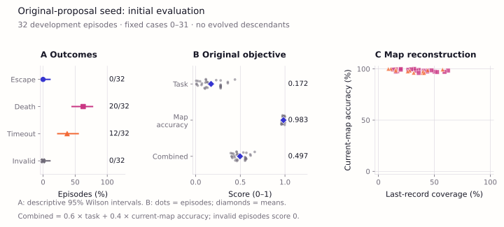
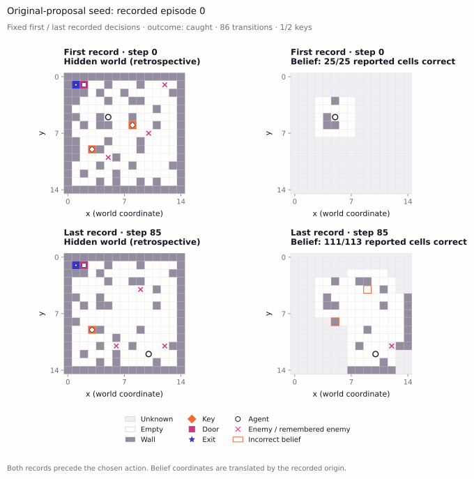

# ShinkaDreamer: Joint Evolution of Map Memory and Planning in a Partially Observed Dynamic Maze

*Scientific implementation report — original-proposal track. Evolutionary results are pending.*

## Abstract

We implement the original Sakana ShinkaDreamer proposal: evolve an executable
agent whose world-model updater integrates partial observations and whose planner
uses that internal map to navigate a dynamic maze. Selection combines task reward
and current-map reconstruction accuracy with the proposed weights of 0.6 and 0.4.
The implementation preserves the 15×15 maze,5×5 observation window, keys, gating
door, moving enemies and changing walls, with explicit repairs to the example
code's coordinates, mechanics and evaluator interface. In an initial development
characterization, the unevolved seed completed 32 valid episodes and escaped in
none;20 ended in capture and 12 timed out. Mean map accuracy was 98.31%, with 32.90%
mean final map coverage. These results characterize the starting agent and show
that accurate remembered cells alone do not establish successful navigation.
Native ShinkaEvolve integration is implemented and prepared; no evolutionary
search has yet executed under this restored objective.

## 1. Introduction

Partial observation makes memory and planning central to maze navigation. An
agent must retain information about previously observed passages and objectives,
reconcile that memory with a changing world, and choose actions using incomplete
knowledge. The [original Sakana proposal](docs/namazu-proposal.md) addresses this
problem by jointly evolving two Python functions:

```python
world_model_step(memory, local_obs, last_action) -> memory
planner(memory, local_obs) -> action
```

The scientific question is whether program evolution improves task performance
and internal-map quality through interpretable changes to these functions.
Possible changes include pathfinding, uncertainty, remembered enemy sightings,
exploration and replanning. Helpers and memory structures remain evolvable; this
is not restricted to scalar tuning or a fixed algorithm catalog.

Here, *world model* means the agent's maintained representation of the current
world. Future prediction and learning an unknown transition law are not required
by this experiment. ShinkaDreamer is not an implementation of neural Dreamer.
Earlier predictive-learning extensions are retained in a separate
[historical archive](docs/experiments-archive.md); none of their measurements or
figures is presented as evidence for this objective.

## 2. Methods

### 2.1 Environment and information boundary

The environment contains a 15×15 maze, two keys, a locked door gating the exit and
three anonymous enemies. The agent receives a 5×5 local observation. It chooses
one of nine attempted displacements, including waiting, and an interaction flag.
Enemies also draw uniform attempted displacements; blocked moves remain stays.
Walls change every 25 transitions and episodes end on capture, escape or the
200-transition horizon.

The implementation reuses the existing repaired maze. Border walls remain fixed,
layouts have feasible objective routes, diagonal corner cutting is disallowed,
and wall closures skip occupied cells. Interaction opens an adjacent cardinal
door before movement when both keys are held and collects a key at the movement
destination. Contact with an enemy before or after enemy movement is fatal.
These are explicit interpretations and repairs of the proposal's prose and
example, documented in [implementation details](proposal/README.md).

Candidates receive local observations, inventory, door state and observable
movement/interaction feedback. The hidden world, world seeds and scoring remain
inside the evaluator. The candidate runs in the existing restricted Python
process, with independent candidate randomness. No forecast interface, hidden
movement-law condition or prediction-learning intervention is imposed.

### 2.2 Initial program and joint evolution

The [initial program](proposal/initial.py) closely follows the proposal: integrate
observations into a persistent map, retain enemy sightings for five steps, move
greedily toward the nearest remembered objective, and otherwise wander randomly.
It has no engineered pathfinder or learned dynamics predictor. Repairs apply
actual displacement before map integration, maintain observable inventory and
door state, represent anonymous sightings, and permit interaction on a key
already under the agent.

The [native launcher](proposal/evolve.py) uses upstream ShinkaEvolve revision
[`9912af1`](https://github.com/SakanaAI/ShinkaEvolve/tree/9912af12d423504b8d580f4179fd15f5f88b8c50).
The proposal's configuration is 100 total slots, including the seed, four islands
and five development episodes per evaluated program. Native parent/archive
sampling, inspirations, migration, diff/full/crossover operators and meta
recommendations are configured. Models must be supplied explicitly through the
subscription-only route. Configuration preparation makes no model calls;
configuration is not evidence that search mechanisms have executed.

The [staged implementation plan](docs/original-proposal-plan.md) proposes adding
the complete native mechanisms with separately reviewed execution budgets. The
[source-level Shinka study](docs/shinkaevolve-research.md) maps sampling, bandits,
novelty, crossover, meta memory, prompt evolution and resumption to the installed
code. The current launcher still lacks parts of that integration; this plan has
not launched a search or added experimental results.

### 2.3 Original fitness

For an episode with length $T$, collected-key count $K$, door indicator $D$, escape
indicator $E$ and capture indicator $C$, the original task reward is

```math
S = \mathrm{clip}_{[0,1]}\!\left(\frac{0.1T+20K+30D+100E-50C+50}{250}\right).
```

After each observation and planning call, but before applying its action, the
evaluator compares the reported `believed_map` with current terrain and enemy
occupancy. Relative map coordinates are translated privately using the initial
agent position. Let $B_t$ contain the reported in-bounds cells at step t. Accuracy is

```math
A = \frac{\sum_t\sum_{x\in B_t}\mathbf{1}[\hat m_t(x)=m_t(x)]}
              {\sum_t |B_t|}, \qquad F=0.6S+0.4A.
```

An empty audit has $A=0$. Fitness is averaged equally over episodes; invalid
executions contribute zero and remain in the denominator. This is reconstruction
of the present after observation, not prediction of a future outcome. The
original positive step reward and reported-cell denominator are retained.
Coverage, escape, capture and timeout are reported separately rather than hidden
inside the composite score.

## 3. Initial experiment

Before execution, we fixed 32 development cases, numbered 0–31, and evaluated only
the initial program, with a maximum of 6,400 transitions. No fitting, candidate
selection or mutation-model calls were performed. These are development cases,
not a fresh assessment or evidence of generalization. The first case's replay
was selected by index before observing its outcome.

This 32-case characterization is separate from the launcher's five-case selection
default. Its score must not be imported as native search fitness; a search must
evaluate its seed and descendants on the same configured panel.

The [saved measurements](artifacts/proposal/initial-evaluation/metrics.json),
[per-episode data](artifacts/proposal/initial-evaluation/episodes.json) and
[source manifest](artifacts/proposal/initial-evaluation/manifest.json) support
all results and figures below. Every figure uses the shared
[Chromatic Fields style](docs/VISUAL_STYLE.md) and only this original-proposal
experiment's data.

## 4. Results

| Measurement | Initial seed,32 episodes |
|:--|--:|
| Escape |0/32 (0%)|
| Capture |20/32 (62.5%)|
| Timeout |12/32 (37.5%)|
| Invalid execution |0/32|
| Mean task score $S$ |0.172325|
| Mean map accuracy $A$ |0.983149|
| Mean combined fitness $F$ |0.496655|
| Mean final map coverage |32.90%|
| Mean collected keys |0.53125|
| Opened door |0/32|
| Mean episode length |137.06 transitions|



**Figure 1. Initial-agent characterization.** All 32 episodes are included.
Outcome intervals are descriptive 95% Wilson intervals for the development panel;
score and accuracy panels retain individual episodes. Coverage is reported
independently of accuracy. These are results for one unevolved program, not an
evolutionary comparison or a held-out success estimate.



**Figure 2. Actual map memory in the first recorded episode.** The first and last
recorded pre-action states show evaluator truth alongside the agent's reported
map, translated into common coordinates. Hidden truth is a retrospective
visualization and was never supplied to the agent. Unknown map cells remain
visually distinct. This case ended in capture; the last displayed state precedes
the terminal action and is not a post-capture reconstruction.

Execution used 4,386 transitions. Summed measured episode wall time was 2.84 seconds
on the current host, including candidate execution; this excludes implementation,
tests and figure rendering. There were zero experiment-model calls. Supervising
assistant work is separate from that call count. Evolutionary throughput and
resource efficiency have not yet been measured for this objective.

## 5. Discussion and limitations

The seed accurately reconstructs the cells it reports, but it does not escape.
Its greedy planner can become blocked or pursue an unsuitable remembered target.
The result establishes an executable starting point with room for behavioral
improvement; it does not show that evolution succeeds or fails.

The original accuracy term has specific limitations. An agent can obtain high
accuracy by retaining easy or recently observed cells while covering little of
the maze. Static terrain also contributes many targets. The 0.6/0.4 coefficients
do not guarantee balanced selection pressure, and the task reward gives a
positive contribution to elapsed steps. We disclose these properties while
preserving the requested objective. High composite fitness must not be described
as proof of understanding.

The next scientific result must come from actual native program evolution under
this objective, with program changes, task outcomes and reconstruction reported
together. That search has not been launched in this implementation step.
Independent discovery reliability, held-out performance and any causal benefit
of a particular memory mechanism remain unmeasured. No publication or novelty
claim is made from these initial results.

## 6. Reproduction

Use the existing environment created by [bootstrap.sh](scripts/bootstrap.sh).
Run the focused correctness checks:

```bash
OPENBLAS_NUM_THREADS=1 .venv/bin/python -m unittest tests.test_proposal
```

Re-evaluate the initial program into a new directory:

```bash
OPENBLAS_NUM_THREADS=1 .venv/bin/python proposal/evaluate.py \
  --program_path proposal/initial.py \
  --results_dir results/proposal-reproduction --episodes 32 --replay-first
```

Regenerate the README figures from the saved experiment, without executing agents:

```bash
OPENBLAS_NUM_THREADS=1 .venv/bin/python proposal/figures.py
```

See [proposal/README.md](proposal/README.md) for preparation and explicit native
launch commands. The launcher defaults to preparation; `--run` is required for
model calls. No historical campaign or assessment is resumed by these commands.

## References

1. Sakana ShinkaDreamer proposal. [Preserved original project description and example code](docs/namazu-proposal.md).
2. Lange, R.T., Imajuku, Y., and Cetin, E. *ShinkaEvolve: Towards Open-Ended and Sample-Efficient Program Evolution.* [Final ICLR 2026 paper](https://proceedings.iclr.cc/paper_files/paper/2026/file/7886b9bafe76c52fd568db10ff9772df-Paper-Conference.pdf); [official implementation](https://github.com/SakanaAI/ShinkaEvolve).
