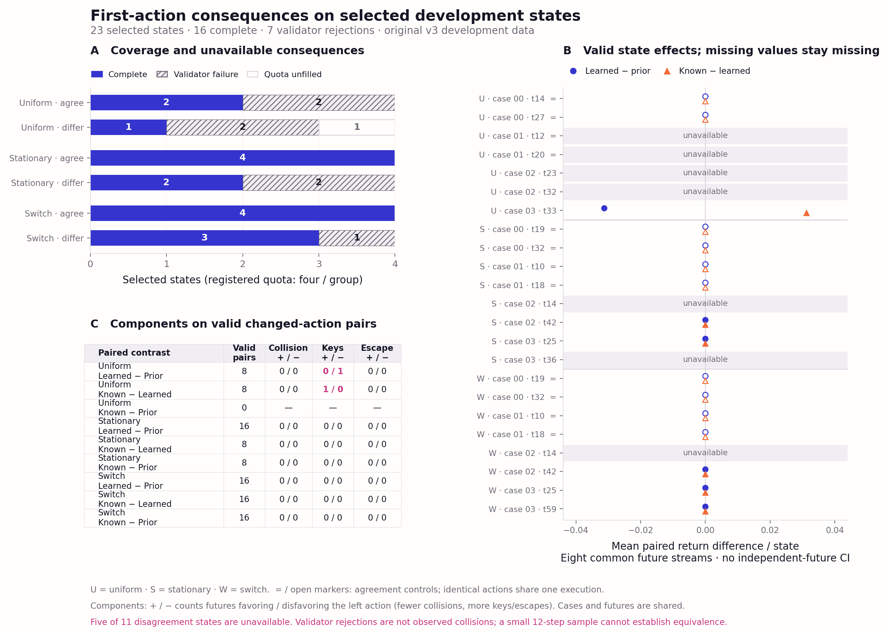

# Branch consequence figure and tables



[SVG](branch-consequences.svg) · [PDF](branch-consequences.pdf)

Panel A preserves all 24 registered state slots: 16 states have complete
consequences, seven were rejected by a memory validator, and one quota slot was
unfilled. Panel B shows means over eight paired futures per complete state;
unavailable states have no point. Open markers and `=` identify identical-action
agreement controls, whose outcomes are aliased by design. Panel C gives exact
component counts for valid pairs with different first actions. Plus/minus means
fewer/more collisions or more/fewer keys or escapes for the left action. A dash
means there were no changed-action pairs for that contrast.

These are selected, previously exposed development states and 12-transition
branches. Futures and states share precursor recordings; there are no confidence
intervals based on treating futures as independent. Five of eleven disagreement
states are missing. Validator failures are not observed collisions, and a zero
observed difference in this small sample does not establish equivalence.

- [State effects](state-paired-effects.csv): all states and all three contrasts;
  invalid-pair counts retained; empty effect cells mean unavailable.
- [Case effects](case-paired-effects.csv): equal state weights within each
  precursor recording, with complete/missing state counts.
- [Component counts](component-pair-counts.csv): all three contrasts, exact
  valid changed-action counts and invalid counts across selected states.

Reproduce from saved checkpoints only:

```bash
.venv/bin/python scripts/run1_branch_figures.py
```

Input and renderer hashes are recorded in `figure-manifest.json`. Rendering runs
no candidate, environment transition or model call.
