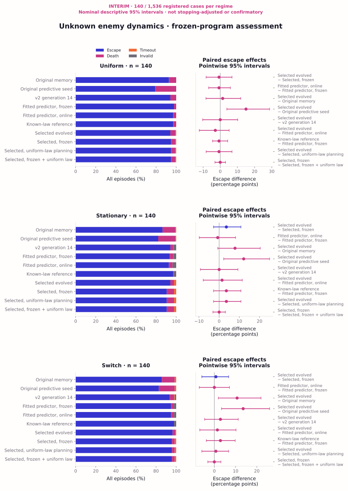

# V3 saved-data assessment and decision report

The completed search found a useful program early, and its online updates learn
something about unknown enemy dynamics. **The saved assessment does not yet
establish that those updates improve escape.** Further hours of the same broad
assessment are not the recommended next step. First resolve the decision and
throughput bottlenecks in a bounded development task.

This report analyzes the checkpoint requested by the user on 8 October 2026 UTC.
The user subsequently authorized this saved-data analysis. No simulation was
resumed: it uses **140 shared cases × three regimes × ten conditions = 4,200
world episodes**, plus **2,100 passive predictor passes on 420 recordings**.
It includes every saved case and all 27 invalid executions. The original
1,536-case assessment remains incomplete and paused.

## Scope and strength of evidence

The program, comparators and full assessment methods were frozen before the
private pool was drawn. The administrative stop happened before escape, task or
prediction effects were aggregated; operational failures and costs were already
known. An [interim protocol](../artifacts/campaign-v3/assessment-interim140/interim-protocol.json)
was committed as `a69110f` before this aggregation. We reused the unchanged
statistics with a 140-case in-memory projection, all original conditions and
contrasts, and 5,000 shared whole-case bootstrap replicates. Forecast resampling
recomputes pooled sums/counts and ratios; paired outcomes retain invalids.

**All intervals below are nominal, pointwise 95% intervals for a descriptive
interim analysis.** They are not stopping-adjusted or confirmatory, and are not
simultaneous intervals across every comparison. The original power calculation
does not apply at 140 cases. Runtime can depend on case difficulty. Selection
validation remains selection-biased; this assessment concerns one selected
program, not reliable discovery across searches. These exposed cases must not
be reused for tuning and then called fresh tests.

## What the 50-slot search achieved

The search began with the executable original predictive seed, not the manually
engineered direction-aware comparator. Generation 4 was a direct descendant of
that seed. Shinka changed its predictive representation to uniform, slow and
fast directional experts, anonymous-observation updates, adaptive expert mixing,
and planning with three future hazard stages. Mapping/localization remain
separate from predictive parameter updates. This is substantive program search,
not fitting ten fixed weights.

| Development result | Seed, slot 0 | Generation 4 | Eventual score leader, generation 46 |
|:--|--:|--:|--:|
| Task score | 0.799156 | 0.950906 | 0.952483 |
| Escapes / 72 | 56 | 69 | 69 |
| Deaths | 15 | 0 | 2 |
| Timeouts | 1 | 3 | 1 |

Generation 4 was the fifth total slot, after four mutations. It captured
**98.97% of the eventual best task-score gain**. Of the following 45 slots,
only generation 46 exceeded its task score; none exceeded its escape count.
That small score increment was entirely the successful-escape speed component.
The separate five-candidate selection still chose generation 4: 180/192 escapes,
versus 179/192 for each other shortlisted source.

Those 45 later slots cost 3,240 development worlds, 4,145.20 candidate-plus-evaluator
CPU seconds, and 46 mutation/repair calls reporting 2,026,270 tokens. All sources
and ASTs were distinct, but generations 18 and 20 had identical action,
observation, physical-trajectory and exported-forecast hashes in all 192
selection pairs. Generation 20's added restart expert never activated in its
saved development or selection episodes. Generation 46 did change trajectories
in 186/192 pairs relative to generation 4, so the later work was not all duplicate
behavior. It nevertheless failed to improve the selected result.

The criticism of diminishing returns is supported by the records. Completing
50 slots followed the explicit initial budget, but a budget is not evidence of
scientific value. A visible early review of the plateau and measured completion
cost should have preceded committing attention to a many-hour assessment.
Retrospectively finding the winner early does not establish that five slots
reliably suffice in future searches.

## Absolute task performance

Each cell below is escapes out of 140; invalid executions count as non-escapes.
Full death, timeout, invalid, task, prediction and CPU results are in the
[outcome tables](../artifacts/campaign-v3/assessment-interim140/tables.md).

| Program / intervention | Uniform | Private stationary law | Unannounced switch |
|:--|--:|--:|--:|
| Original memory | 130 | 121 | 120 |
| Original predictive seed | 111 | 115 | 116 |
| Historical v2 generation 14 | 132 | 132 | 131 |
| Training-fitted predictor, frozen | 137 | 131 | 133 |
| Same fitted predictor, online | 136 | 130 | 133 |
| Known-law reference | 136 | 136 | 137 |
| **Selected generation 4, online** | **132** | **132** | **135** |
| Selected, predictive updates frozen | 133 | 127 | 134 |
| Selected, uniform-law planning | 133 | 127 | 134 |
| Selected, frozen + uniform-law planning | 133 | 127 | 134 |

Selected escape rates are 94.29%, 94.29% and 96.43%. Its task-score means are
0.93735, 0.93703 and 0.95529. Across its 420 worlds it had 399 escapes, 16 deaths,
five timeouts and no invalid executions. This is good performance, not a solved
task and not a verified learning benefit.

Selected minus memory escape is +1.43 percentage points in uniform cases
[−8.31, +11.92], +7.86 in stationary cases [−0.67, +20.35], and +10.71 in switch
cases [+1.87, +21.97]. It improves over the original predictive seed by observed
12–15 points, but does not establish superiority over the stronger historical
or fitted controls. Against v2 generation 14 the differences are 0, 0 and
+2.86 points, all with intervals spanning zero. Those v2-source scores belong
to this separate v3 environment; the published historical v2 results are unchanged.



## Does online learning improve control?

The intervention freezes the selected program's predictive updates and
forgetting while allowing mapping and localization to continue.

| Regime | Online − frozen escape, percentage points [95% interval] | Online-only / frozen-only escapes | Changed action sequences / 140 |
|:--|--:|--:|--:|
| Uniform | −0.71 [−8.22, +6.84] | 2 / 3 | 59 |
| Stationary | +3.57 [−2.79, +10.78] | 6 / 1 | 67 |
| Switch | +0.71 [−5.89, +6.73] | 2 / 1 | 64 |

The stationary direction is encouraging, but is based on seven discordant
pairs. Its exact McNemar p-value is 0.125; the original two-test Holm calculation
gives 0.25, retained descriptively. Switch gives p=1.0. These data neither prove
a benefit nor establish equivalence or no effect. They do not show that changing
dynamics specifically increases the control value of learning.

For this selected representation, frozen initialization induces uniform-law
planning. The three frozen/uniform-planning conditions have the same observed
task outcomes. The complete online-versus-frozen uniform-planning pairs match
actions, physical observations, map/position audits and trajectories on all
420 cases. Their separate prediction exports still differ: this gives a clean
matched-experience prediction comparison, but not three independent control
discoveries. The manual fitted comparator likewise has no established online
escape benefit: −0.71, −0.71 and 0.00 points across the three regimes.

## Does online learning improve prediction on identical experience?

All five passive predictors saw the same recorded memory-policy observations
and preceding actions. All 420 records passed observation, within-source
initialization, freezing and target-count checks; there were no missing forecasts
or shadow failures. Positive values below mean lower pooled near-cell Brier loss
with online updates. This predicts one-step enemy occupancy, not episode success.

| Regime | Evolved online vs frozen: relative loss reduction [95% interval] | Fitted online vs frozen |
|:--|--:|--:|
| Uniform | **−0.93%** [−1.34, −0.51] | −0.98% [−1.42, −0.52] |
| Stationary | **+1.21%** [+0.50, +2.05] | +1.29% [+0.44, +2.22] |
| Switch | **+1.58%** [+0.63, +2.61] | +1.89% [+0.62, +3.39] |

These comparisons score 73,350, 79,785 and 78,858 near-cell targets per predictor,
respectively; those targets are dependent, not independent sample units.
The selected learner's stationary Brier loss changes from 0.00584018 to
0.00576926, and switch loss from 0.00550519 to 0.00541816. The gains are real
observed improvements in prediction, but small in absolute loss. Both learners
slightly degrade an already correct uniform-dynamics prior.

On the selected program's identical uniform-planning trajectories, the evolved
learner's reductions are −0.27% [−0.87, +0.42], +2.29% [+0.99, +3.83] and +2.26%
[+1.07, +3.52]. This second policy distribution reinforces the directional
pattern. It is not another independent search or assessment cohort.

The evolved and manually fitted online predictors have similar aggregate
near-cell losses: their pairwise intervals span zero in every regime. The
known-law reference lowers loss a further **8.01%** [6.24, 9.82] in stationary
cases and **9.98%** [7.84, 12.19] in switch cases relative to the selected learner.
There is predictive headroom. The reference receives privileged current laws
while retaining partial observability; it is not an optimal-policy upper bound.
Its same-planner escape advantage over fitted-frozen is +3.57 points
[−2.79, +10.78] and +2.86 [−3.77, +9.81], respectively: directionally favorable,
still uncertain.

The more action-specific destination-occupancy diagnostic is weaker. On the
same memory recordings, evolved online versus frozen changes destination loss
by −1.28% reduction [−4.38, +1.57] in stationary cases and +0.92% [−2.79, +5.16]
in switch cases. Neither establishes improvement. This limits the inference
from better near-cell prediction to better decision-relevant prediction; the
destination event itself is still not full collision or death risk.


## What the mechanisms do—and what remains unclear

The frozen-state audits pass; the selected online predictive state changes in
403/420 worlds. There are no selected localization errors in the 23,183 checked
steps. Parameter changes include forgetting and regularization, so they must not
be counted as informative observations. The matched losses, rather than flags
or changing arrays alone, provide evidence of predictive adaptation.

Only **75/140 selected switch episodes encounter the replacement law**, and
40/140 contain a recorded post-switch occupancy contrast under the conservative
observation proxy. There are 2,214 post-switch steps, 934 with visible enemies,
and 164 post-switch source-cell contrasts. The experiment is not devoid of
switch exposure, but many episodes cannot inform post-switch adaptation because
they end early or provide limited informative observations. Unconditional
outcomes remain primary; post-switch-only analyses select survivors.
For example, memory-recorded post-switch loss reduction is +1.52% [−0.19, +3.21],
less conclusive than the whole-episode switch result. Whole-episode improvement
does not alone establish rapid relearning after a switch.

The decision signal combines three stages of before/after enemy occupancy risk
with weights 1, 0.55 and 0.25 in a route cost. Future stages are unconditional
marginals, not survival-conditioned path-death probabilities. The exported
near-cell forecast and actual planning costs therefore have different meanings.
Destination occupancy after enemy movement also omits immediate entry-contact
risk; it is not the death event. Better occupancy prediction can fail to change
the important action ranking or improve escape.

An exploratory inspection of the prespecified first 32 retained case pairs per
regime finds 18, 14 and 13 first-action divergences. Only two of these retained
pairs differ in terminal outcome: uniform case 20 hurts the selected online
agent; stationary case 25 favors it. At case 25's first divergence both immediate
hazards are zero and a small continuation-cost preference flips. That illustrates
changed route choice, not proof of an immediate collision-risk rescue. These are
illustrative exposed traces, not a representative sample of all causal effects.
Across those 45 first divergences, all preceding physical states and map/position
audits agree and all exported occupancy forecasts differ. In 42/45, both compared
moves have zero immediate hazard; future costs and navigation dominate these
first choice changes. Only 3/13 switching divergences follow an observed
replacement-law outcome. These findings support examining the actual decision
signal before interpreting generic forecast gains as switch-adaptation control.

## Costs, failures and why the long estimate arose

The full design requests 46,080 world episodes plus 23,040 passive passes. Its
1,536-case sample size targeted a meaningful three-percentage-point escape
difference, with conservative discordance planning from only 24 development
cases per regime. A precision calculation had a scientific rationale; it did
not establish that this broad workload was the best use of the available time.
The 1,024-case minimum and rounding to 256-case increments were design choices,
not facts established by those 24 cases. Ten conditions further multiplied
execution cost beyond the two primary online-versus-frozen regime contrasts.

The paused 140-case assessment used **58 minutes 19 seconds** by GNU elapsed
time, **2.99 CPU hours**, and 232,028 world steps. Four workers already ran on
four physical cores. The earlier measured rolling-queue opportunity was about
20%; it cannot turn an eight-to-ten-hour remainder into 20 minutes. Eight
logical CPUs are not eight independent physical cores. No distributed runner
had been provisioned. Reducing scope and per-episode work is necessary for that
turnaround; additional parallelism alone is insufficient on this machine.

Mean selected candidate CPU is 1.24–1.47 seconds per episode, versus 2.45–3.05
for the v2/fitted/known-law family and 0.38–0.42 for memory. The selected
uniform-planning conditions cost about 1.93–2.12 seconds because they retain
the forecasts and recompute planning hazards. A behaviorally disabled condition
is not necessarily a cheaper execution path.

The 27 invalid worlds all report worker exit −9 in the v2/fitted/known-law family.
They are consistent with the fixed 10-second CPU boundary; exit −9 alone does
not prove the kill cause. No selected condition failed. All failures stay in
outcome denominators; observed forecast losses on partial executions are not
reliability-adjusted prediction scores. Changes to source or resource boundaries
would require a separately disclosed evaluation, not rewriting these results.

The experiment route recorded **116 model calls and 3,811,874 reported tokens**:
49 mutations, one repair, 50 summaries, six global-insight calls, six
recommendations and four probes. The 62 meta calls accounted for 40.1% of native
tokens and 11.6% of measured native call time; they were not tested for causal
search value. One model, inactive novelty and exercised islands/migration must
not be conflated with testing all Shinka mechanisms. The subscription route was
used without paid fallback. Tokens include cached input; actual subscription
charges and remote CPU are unmeasured. Assistant conversation and review-agent
usage are outside the experiment-call ledger.

Across v3 to date, **9,590 world episodes and 2,132 isolated shadow passes** have
run. This analysis adds zero episodes and zero experiment-route model calls; its
first statistical pass took about 11 elapsed seconds and 12 CPU seconds. Figure
rendering, verification and assistant work are additional reporting costs. The
saved UTC and monotonic run clocks differ by about 10%; both remain reported
separately rather than silently reconciled.

## Recommended next decision

1. **Keep the full assessment paused.** Accept the current deliverable as an
   informative interim result: prediction learning is observed, escape benefit
   remains unresolved, and one early program accounts for almost all task gain.
   More cases would narrow uncertainty about this program, but cannot establish
   reliable discovery or repair a weak decision signal.
2. **If further implementation is wanted, first authorize one 20-minute,
   development-only diagnostic with no mutation-model calls.** Give it a hard
   wall-clock stop and an episode cap, set before launch. Profile the expensive
   candidate/planner work, inspect actual hazard rankings, and contrast fitted
   versus known-law decisions on development cases. Deliver measured bottlenecks
   and a small concrete proposal; a positive result is not required. Any
   semantics-preserving optimization needs trajectory/forecast equivalence
   checks before it is trusted. Do not silently alter the frozen assessment.
3. **Choose the scientific branch explicitly after that review.** For precision
   about this fixed program, retain the original sources and disclose this
   interim look in any resumed inference. For better discovery or learning
   mechanisms, design a new, bounded development wave with fresh final cases,
   prospective checkpoints and an explicit slot/call/time budget. Short
   independent searches are relevant to repeatability, but their number and
   size are not established by this single run. Avoid choosing conditions or
   stopping thresholds merely because these 140 results look favorable.

Do not automatically launch 24 searches, another 50-slot copy, a weight sweep,
or the remaining assessment. Proposed engineering and new experiments above
have not been executed by this report.

## Reproduction and preserved checkpoint

Recompute the interim statistics from committed compact records, then render:

```bash
OPENBLAS_NUM_THREADS=1 .venv/bin/python scripts/v3_interim_analysis.py --compact
.venv/bin/python scripts/v3_figures.py \
  --analysis artifacts/campaign-v3/assessment-interim140/analysis.json \
  --matched artifacts/campaign-v3/assessment-interim140/matched-analysis.json \
  --out artifacts/campaign-v3/assessment-interim140/figures
```

Without `--compact`, the wrapper verifies the locally retained 140 case and
420 matched-file hashes against the recorded protocol. It never loads or
executes candidate programs. The original full analysis and preregistration
remain unchanged. Compact records, tables and figures are in
[assessment-interim140](../artifacts/campaign-v3/assessment-interim140).
The [search efficiency review](../artifacts/campaign-v3/search-efficiency-review.json)
records marginal costs and source/behavior diversity.
The [decision review](../artifacts/campaign-v3/assessment-interim140/decision-review.json)
can be regenerated from retained private recordings with
`.venv/bin/python scripts/v3_decision_review.py`; it executes no candidate.

The exact **simulation recovery command, not authorized for execution now**, is:

```bash
.venv/bin/python scripts/v3_assessment.py \
  --plan artifacts/campaign-v3/assessment/preregistration.json \
  --out results/campaign-v3-assessment --workers 4
```

Use one controller and the same reserved pool; never add `--reserve-pool` on
resume. Pending state and all old evidence remain preserved. The historical
[checkpoint report](v3-checkpoint-report.md) describes the state before this
interim aggregation and remains valid as that dated snapshot.
